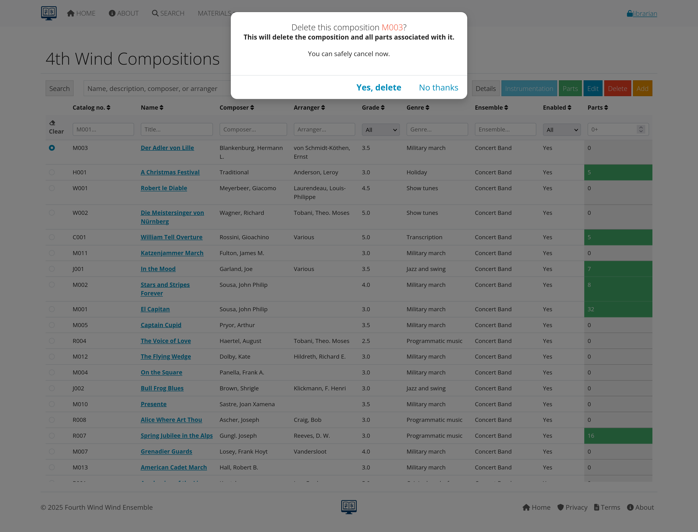

# Sample Screenshots for AllanaCrusis Documentation

This directory contains screenshot examples. Replace these placeholders with actual screenshots.

## Needed Screenshots:

### Main Interface
- [x] `main-interface.png` - Dashboard/homepage view
- [x] `navigation-menu.png` - Top navigation expanded
- [x] `search-bar-example.png` - Global search in action

### Composition Management
- [x] `add-composition-form.png` - New composition form
- [x] `edit-composition.png` - Editing existing composition
- [ ] `composer-autocomplete.png` - Autocomplete feature in action
- [x] `compositions-table.png` - Main compositions listing

### Parts Management
- [ ] `parts-list.png` - Parts listing for a composition
- [ ] `edit-part-form.png` - Individual part editing
- [ ] `instrumentation-screen.png` - Instrumentation assignment

### Search and Filtering
- [x] `advanced-search.png` - Advanced search form
- [x] `table-filtering.png` - Real-time table filtering
- [ ] `search-results.png` - Search results display

### User Management
- [x] `user-list.png` - User management screen
- [x] `add-user-form.png` - New user form
- [x] `user-permissions.png` - Role assignment interface

### Login and Authentication
- [x] `login-screen.png` - Login form
- [ ] `email-verification.png` - Email verification prompt
- [x] `register.png` - First time registration
- [ ] `password-reset.png` - Password reset form

## Screenshot Guidelines:
1. Use consistent browser (Chrome recommended)
2. Clear any personal data
3. Use demo/sample data
4. Capture at 1920x1080 or similar resolution
5. Save as PNG for best quality

---
## Available Screenshots

### Main Interface and Navigation
-  - About page view
-  - Main dashboard/homepage
-  - Primary interface overview
-  - Standard navigation menu
-  - Administrator navigation menu
-  - Librarian navigation menu
-  - Search interface overview
-  - Search functionality in action

### User Management and Authentication
-  - User listing and management
-  - User creation and editing form
-  - Login screen
-  - New user registration form
-  - Password reset interface
-  - Post-login welcome screen

### Composition Management
-  - Main compositions listing
-  - Composition creation/editing form
-  - Alternative composition form view
-  - Composition deletion interface
-  - Instrumentation assignment

### Parts and Collections
-  - Part collections overview
-  - Expanded part collections view
-  - Part types management
-  - Part type creation/editing
-  - Part type ordering interface

### Supporting Data Management
-  - Instrument management listing
-  - Instrument creation/editing form
-  - Individual instrument details
-  - Instrument ordering interface
-  - Genre management
-  - Genre creation/editing form
-  - Ensemble management
-  - Ensemble creation/editing form
-  - Section management
-  - Section creation/editing form
-  - Section leader assignment
-  - Instrument assignment to sections
-  - Paper size management
-  - Paper size configuration

### Concerts and Recordings
-  - Concert creation/editing interface
-  - Recording management listing
-  - Recording creation/editing form

### System Administration
-  - Feature enable/disable interface
-  - Manager selection interface
-  - System reports overview
-  - Download token reports
-  - Detailed parts reporting
-  - Playgram management interface

