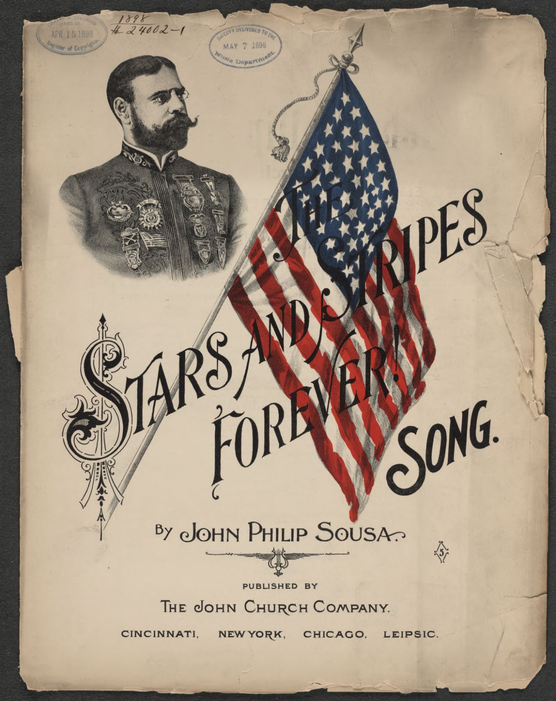
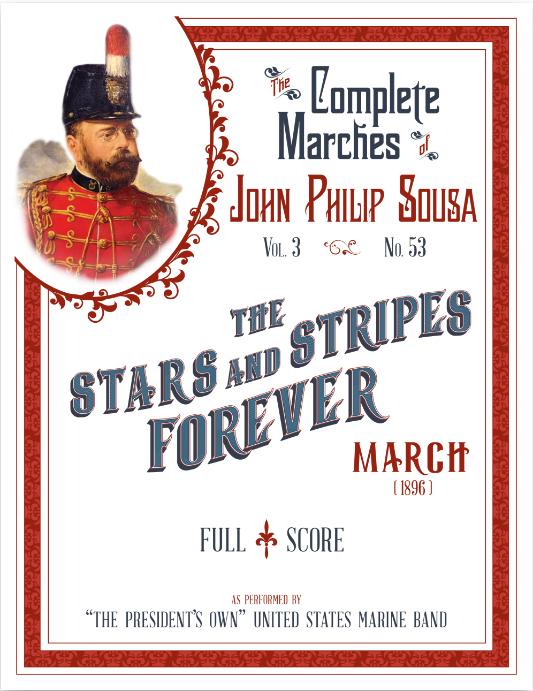

# Managing compositions

This section covers how to add, edit, and manage musical compositions in AllanaCrusis. Compositions are the core organizational unit of your music library.

## Table of contents
- [Describing compositions](#describing-compositions)
- [Viewing compositions](#viewing-compositions)
- [Adding or editing compositions](#adding-or-editing-compositions)
- [Managing title, composer, and arranger names](#managing-title-composer-and-arranger-names)
- [Searching and discovering](#searching-and-discovering)
- [Next steps](#next-steps)

---

## Describing compositions

### What is a Composition?
A **composition** in AllanaCrusis represents a complete musical work that encompasses all the essential details needed for library management. This includes basic information such as the title, composer, and arranger, along with publishing details like the publisher and catalog number. Performance data is also captured, including grade level, duration, and instrumentation requirements. The system organizes compositions by genre and ensemble assignment, while also tracking physical details such as paper size and page counts for practical library management.

*Figure 1: Stars and Stripes Forever composition*

### Composition vs. parts
Understanding the relationship between compositions and parts is fundamental to using AllanaCrusis effectively. A composition represents the overall musical work and contains all the metadata about the piece. Everything from the composer and title to the grade level and performance duration is included. Parts, on the other hand, are the conductor's score, and individual instrument parts that belong to that composition, such as the first trumpet part, the clarinet parts, or the percussion parts. This creates a one-to-many relationship where a single composition can have many different parts associated with it, each representing what a specific instrument or section would play during a performance.

*Figure 2: Stars and Stripes Forever score*

---

## Viewing compositions

### Accessing the list of compositions

1. **Navigate to MATERIALS > Compositions**
2. **View the complete library** of compositions
3. **Use sort, filters and search** to find specific works
4. **Sort by different criteria** (title, composer, date added, etc.)
5. **Choose an action button** to manage composition details

*Figure 3: Main compositions list with search and filter capabilities*

### Compositions table features
- **Select a composition**: Select a composition to edit or delete
- **Links to composition details**: Show details of a composition in the table
- **Action buttons**: Quick access to edit, view, or manage each composition

### Composition details view
Click any composition title to see complete metadata:

- **Catalog**, for example, **M001**
- **Composition**, for example, *Stars and Stripes Forever, The*
- **Enabled**, Yes or No
- **Description**, for example, *As performed by the President's Own United States Marine Band*
- **Composer**, for example, "Sousa, John Philip"
- **Arranger**
- **Editor**, for example, "United States Marine Band"
- **Publisher**, for example, "Public Domain"
- **Genre**, for example, "Military march"
- **Ensemble**, for example, "Fourth Wind Wind Ensemble"
- **Grade**, for example, 4.0
- **Last performed**
- **Duration (secs)**, for example, 210
- **Performance notes**, for example, "The U.S. Marine Band score contains extensive performance and historical notes."
- **Listening link**
- **Paper size**, for example, Folio
- **Picture**
- **windrep.org link**, for example, https://www.windrep.org/Stars_and_Stripes_Forever,_The_(1896)
- **Record updated**, for example, 2020-07-04 10:05:27

---

## Adding or editing compositions

### Perequisites
- The **Librarian role** is required
- **Supporting data** (genres, ensembles, paper sizes) should already be configured
- Your **Catalog numbering system** is understood

Most of the information you need is provided in the composition's score.

### Starting the process
To start the process, go to **MATERIALS > Compositions**. You can also edit a composition by choosing one from the SEARCH page.

### Adding compositions
1. Search the existing compositions to check that your piece is not already there.
2. Click **Add**
3. The composition form opens
4. Complete the required fields, and click "Insert"

### Editing compositions
1. Choose a composition to edit. You can search by name or composer, or filter any column.
2. Click **Edit**
3. The composition form opens
4. Complete the required fields, and click "Update"

### Composition fields

*Figure 4: Top of the composition form*

The following fields are available when adding or editing a composition, listed in the order they appear on the form:

| Field | Required | Description |
|-------|----------|-------------|
| Catalog number | ✓ | A unique identifier for the composition, following your organization's numbering scheme. This field is required and must be unique within the system. Your organization determines how to format the catalog numbers. Follow the catalog number that appears on the music folder or envelope. You can use letters or numbers, or combinations. For example, you can represent the genre and a number with a numbering system like "C001" for concert piece, "M001" for a march, and "X010" for a Christmas piece. |
| Enabled | ✓ | Controls whether the composition appears in searches and is available to users. Compositions not marked Enabled remain in the database but are hidden from general use. The default is not enabled. |
| Title | ✓ | The complete title of the composition as it appears on the score. This field is required, and should include subtitles and follow standard capitalization rules. Put articles at the end, for example, "Liberty Bell, The" |
| Description |  | A publicly viewable description. The description provides additional context about the composition, arrangement details, or performance notes for users browsing the library. |
| Composer | ✓ | The name of the original composer. Use "Last, First" format, for example "Sousa, John Philip". This required field uses autocomplete to maintain consistency across the library. Use "Traditional" or "Unknown" if the composter is unknown. |
| Editor |  | The name of the person who edited this particular edition or arrangement. The editor is useful for distinguishing between different versions of the same work. |
| Arranger |  | The name of the arranger if this is an arrangement of an original work. The arranger name follows the same "Last, First" format as the composer field. |
| Publisher |  | The publishing company or organization that produced this edition. You can generally drop words like Inc, Publisher, Company, and such. For example, Hal Leonard Corporation can be listed just as Hal Leonard. |
| Genre |  | The musical style or category selected from your organization's genre list. The genre helps with organization and searching within the library. |
| Ensemble |  | The intended primary performing group or ensemble of this composition. Choose from your organization's ensemble definitions. |
| Grade level |  | The difficulty rating typically on a scale of 0-7. Grade level 0 indicates "unknown" and higher numbers represent increasing difficulty levels. This information is usually provided with the composition's score. |
| Paper size |  | The physical paper dimensions of the parts. Paper size is important for storage and distribution planning. Most band music is printed on Folio paper (9x12), but some are on Letter (8.5x11) or Marching band paper. |
| Last performed |  | The most recent date this composition was performed by your organization. Last performed date is useful for tracking repertoire usage and planning future concerts. |
| Duration (seconds) |  | The performance time entered in hours, minutes, and seconds format. Duration is helpful for concert planning and program timing. Composition durations are accumulated for concert programs planning. |
| Comments |  | Internal library notes about the composition. Comments are not visible to the public; they are used for librarian communication and special handling instructions. |
| Performance notes |  | Public-facing performance or "liner notes" that provide historical context, performance guidance, or interesting facts about the composition. |
| Storage location |  | The physical location where the music can be found, such as building, filing cabinet, or drawer information for easy retrieval. |
| How acquired | ✓ | The method by which the composition was obtained (Purchased, Rented, Borrowed, or Donated). Acquisition method is important for tracking ownership and return obligations. |
| Date acquired |  | When the composition was added to the library collection. Acquisition date is useful for inventory tracking and collection development analysis. |
| Cost |  | The purchase price or replacement cost of the composition, valuable for insurance purposes and budget planning. |
| Listening example |  | A URL or reference to where a recording of this specific arrangement can be found. Listening examples help users preview the music before performance. |
| Image path |  | The location of an image file showing the first page of the score. An image provides visual reference for users browsing the library. |
| Wind Repertory Project link |  | A direct link to this composition's entry on the Wind Repertory Project website. You can use https://www.windrep.org/ for additional research and performance information. A **Search** button next to this field opens a new browser tab to windrep.org pre-populated with a search on the composition's title. |
| Source, or holder |  | Information about who holds the music if it's borrowed or rented, or where it's been loaned if your organization has lent it out. |
| Last inventory |  | The date when someone last physically handled or verified the presence of this music. Last inventory date is important for collection maintenance and auditing. |

*Figure 5: Bottom of the composition form*

---

## Managing title, composer, and arranger names

### The importance of consistent naming

Consistent naming conventions are critical for effective library management. When composer and arranger names are standardized and titles follow formatting rules, your library becomes more searchable and professional. Users can find all works by a composer regardless of who entered the data, while reports and statistics remain accurate and meaningful.

### How AllanaCrusis helps with name normalization

AllanaCrusis includes built-in features to maintain consistent names across your library. The autocomplete system activates when you type in composer or arranger fields, presenting suggestions from existing entries to prevent duplicates with spelling variations. Selecting from these suggestions automatically applies "Last, First" formatting for consistency.

### Name formatting standards and best practices

Use "Last, First Middle" format for composer names. Complex names like "Beethoven, Ludwig van" ensure surnames appear first for better sorting. Single names like "Palestrina" can be entered as-is.

For composition titles, move articles to the end: "The Liberty Bell" becomes "Liberty Bell, The" and "A Lincoln Portrait" becomes "Lincoln Portrait, A." Apply this to foreign articles too (la, le, les, los, die, der, etc.): "La Marseillaise" becomes "Marseillaise, La." This prevents all "The" titles from clustering together and makes alphabetical browsing more logical.

### Handling special cases and edge situations

Use "Traditional" for folk music or unknown authorship. Use "Unknown" when the composer is completely unidentified. For multiple composers, list the primary composer first and note others in the description. For pseudonyms, use the most recognized form and note the real name in the description field.

---

## Searching and discovering

### Making compositions easy to find

Complete the key fields that musicians use to search for music. Focus on titles, composers, arrangers, ensembles, and genres first, then add descriptions with alternate names or memorable details that help users locate specific pieces.

### Essential fields for searchability

Focus on these core fields to maximize findability. The **title** field should include the complete title plus any common alternate names in the description. For **composer** names, consistent "Last, First" formatting ensures users find works whether they search "Sousa" or "John Philip Sousa." The **genre** field helps users browse by style, while **grade level** enables filtering by difficulty. Don't skip the **description** field - it's searchable and perfect for alternate titles, movement names, or other terms users might remember.

### Practical search optimization strategies

Include subtitle information, for example: "Nimrod" in the description for "Enigma Variations." Add movement names for multi-movement works. Use the description field for memorable lyrics: add "O beautiful for spacious skies" to help users find "America the Beautiful." Include instrumentation details for unusual scoring, and mention any special performance requirements that users might search for.

### Common search scenarios to support

Users typically search by composer when planning concerts around specific periods or styles. They search by title when they remember part of a name, by grade level when selecting appropriate repertoire, and by genre when building themed programs. Support partial searches by avoiding abbreviations in titles - write "Symphony" not "Sym." and "Overture" not "Ov." This makes your library work the way musicians think.

### Grade level and duration for program planning

Accurate **grade level** and **duration** data helps you promote effective concert planning. Directors use grade levels to match repertoire difficulty to ensemble abilities, while duration information helps create properly timed programs. AllanaCrusis's **Playgram Builder** page uses these fields along with other composition metadata to help musical directors build balanced concert programs automatically.

---

## Next steps

With compositions properly managed:

1. **[Set up Instrumentation](instrumentation.html)** - Define what instrument parts are needed
2. **[Learn Parts Management](parts.html)** - Handle individual instrument parts
3. **[Explore Concert Tracking](concerts-recordings.html)** - Connect compositions to performances
4. **[Set up Distribution](distribution.html)** - Share compositions with users

---

*Continue to the next section: [Instrumentation Management](instrumentation.html) to learn about setting up what instrument parts are needed for each composition.*