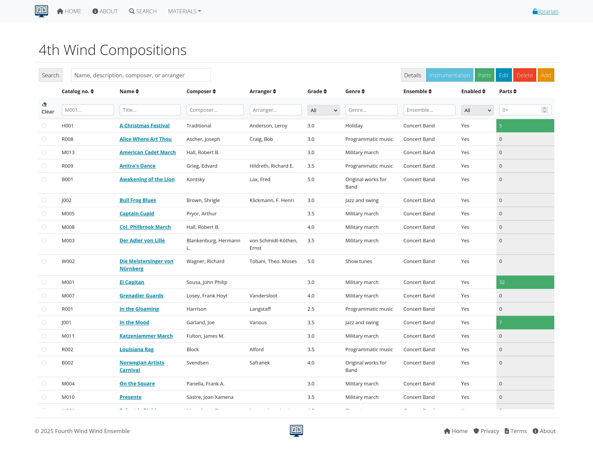
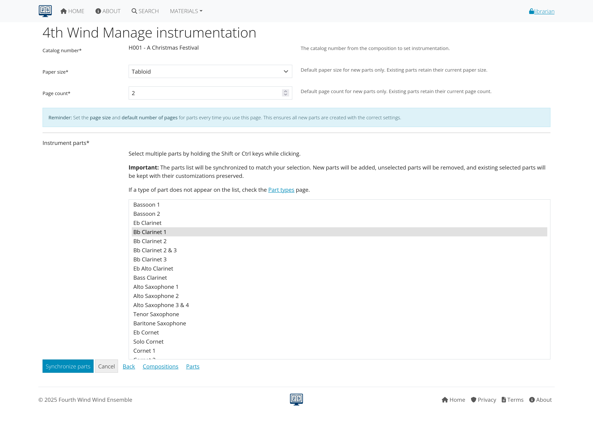
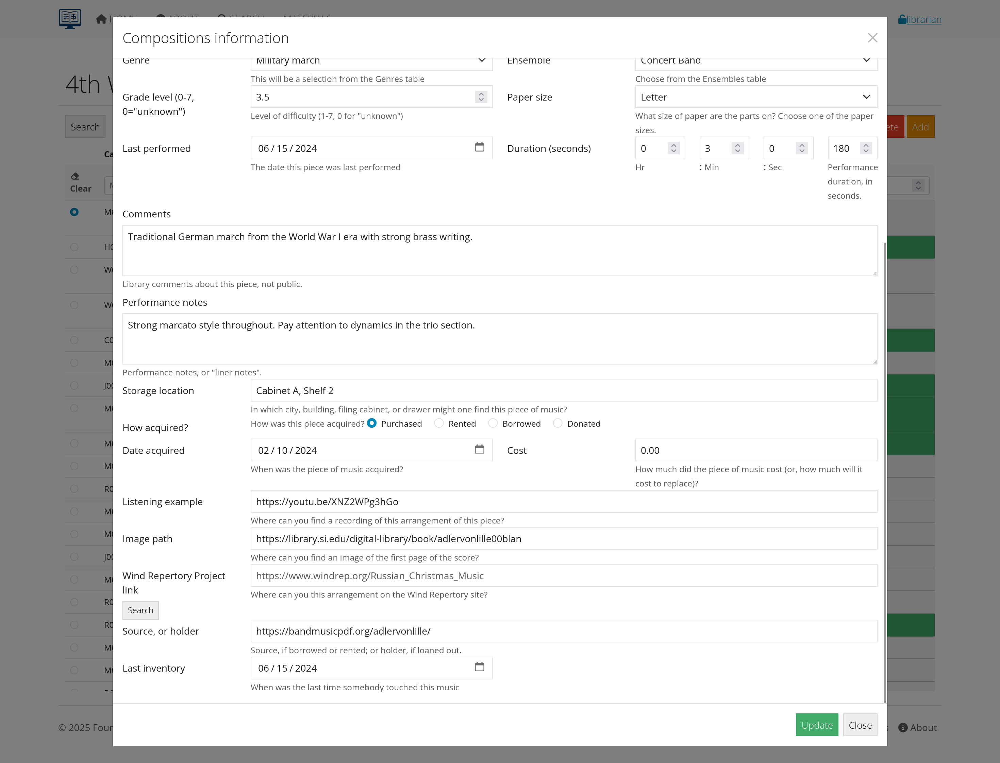

# Composition Management

This section covers how to add, edit, and manage musical compositions in AllanaCrusis. Compositions are the core organizational unit of your music library.

## Table of Contents
- [Understanding Compositions](#understanding-compositions)
- [Viewing Compositions](#viewing-compositions)
- [Adding New Compositions](#adding-new-compositions)
- [Editing Existing Compositions](#editing-existing-compositions)
- [Composer Name Management](#composer-name-management)
- [Metadata Best Practices](#metadata-best-practices)
- [Bulk Operations](#bulk-operations)

---

## Understanding Compositions

### What is a Composition?
A composition in AllanaCrusis represents a complete musical work, including:
- **Basic information**: Title, composer, arranger
- **Publishing details**: Publisher, catalog number
- **Performance data**: Grade level, duration, instrumentation
- **Organization**: Genre, ensemble assignment
- **Physical details**: Paper size, page counts

### Composition vs. Parts
- **Composition**: The overall musical work and its metadata
- **Parts**: Individual instrument parts that belong to the composition
- **Relationship**: One composition can have many parts

*Figure 1: How compositions relate to their individual parts*

---

## Viewing Compositions

### Accessing the Compositions List
1. **Navigate to MATERIALS > Compositions**
2. **View the complete library** of compositions
3. **Use filters and search** to find specific works
4. **Sort by different criteria** (title, composer, date added, etc.)

### Compositions Table Features
- **Real-time filtering**: Type in filter boxes to narrow results
- **Sortable columns**: Click headers to sort by that field
- **Sticky headers**: Column headers stay visible while scrolling
- **Action buttons**: Quick access to edit, view, or manage each composition

*Figure 2: Main compositions list with search and filter capabilities*

### Composition Details View
Click on any composition title to see:
- **Complete metadata**
- **List of associated parts**
- **Performance history** (if tracked)
- **Download links** (for authorized users)
- **Quick action buttons**

*Figure 3: Detailed composition view showing all metadata and parts*

---

## Adding New Compositions

### Prerequisites
- **Librarian or Manager role** required
- **Supporting data configured**: Genres, ensembles, publishers
- **Catalog numbering system** understood

### Step-by-Step Process

#### 1. Start the Add Process
1. **Go to MATERIALS > Compositions**
2. **Click "Add New Composition"**
3. **The composition form opens**

#### 2. Required Fields
Fill in the essential information:

**Catalog Number**
- Format: Letter + 3 digits (C###, M###, X###)
- Must be unique in the system
- Use organizational numbering scheme

**Title**
- Complete composition title
- Articles at the end: "Liberty Bell, The"
- Include subtitles if relevant

**Composer**
- Use "Last, First" format: "Beethoven, Ludwig van"
- Autocomplete will suggest existing composers
- Required field - use "Traditional" or "(n/a)" if unknown

*Figure 4: New composition form with required fields highlighted*

#### 3. Optional but Important Fields

**Arranger/Editor**
- Use same "Last, First" format as composer
- Leave blank if not applicable
- Autocomplete available

**Publisher**
- Choose from existing list or add new
- Abbreviate common words: "Hal Leonard" not "Hal Leonard Corporation"

**Genre**
- Select most appropriate category
- Default to "Wind Ensemble" if uncertain
- Affects search and organization

**Ensemble**
- Primary performing group for this composition
- Usually set by your organization

*Figure 5: Optional fields section of the composition form*

#### 4. Performance Information

**Grade Level**
- Difficulty rating (1-7 scale typically)
- Check score or Wind Repertory Project for guidance
- Leave blank if unknown

**Duration**
- Performance time in minutes
- Can be approximate
- Helpful for concert planning

**Paper Size**
- Most band music: Folio (9x12)
- Some music: Letter (8.5x11)
- Marching band: Often special sizes

#### 5. Save the Composition
1. **Review all information** for accuracy
2. **Click "Add Composition"**
3. **Confirmation message** appears
4. **Composition is now in the system**

---

## Editing Existing Compositions

### When to Edit Compositions
- **Correcting errors** in metadata
- **Adding missing information** (grade level, duration)
- **Updating publisher information**
- **Changing organizational assignments**

### Editing Process
1. **Find the composition** using search or browse
2. **Click the blue "Edit" button**
3. **Make necessary changes**
4. **Click "Update"** to save changes

*Figure 6: Editing an existing composition with pre-filled data*

### Common Edits
- **Title corrections**: Fix spelling or formatting
- **Composer standardization**: Ensure consistent naming
- **Missing metadata**: Add grade level or duration
- **Genre reclassification**: Move to more appropriate category

---

## Composer Name Management

### Importance of Consistent Naming
- **Search effectiveness**: Users can find all works by a composer
- **Reporting accuracy**: Statistics and analysis work properly
- **Professional appearance**: Library looks organized and authoritative

### Composer Normalization Features
AllanaCrusis includes tools to help maintain consistent composer names:

#### Autocomplete System
- **Start typing** a composer name
- **Suggestions appear** based on existing entries
- **Select from list** to ensure consistency
- **Automatic formatting** to "Last, First" format

*Figure 7: Composer autocomplete suggesting existing entries*

#### Name Formatting Rules
- **Standard format**: "Last, First Middle"
- **Multiple names**: "Beethoven, Ludwig van"
- **Titles and suffixes**: "Bach, Johann Sebastian"
- **Single names**: "Palestrina" (historical figures)

#### Special Cases
- **Traditional works**: Use "Traditional"
- **Unknown composer**: Use "(n/a)"
- **Multiple composers**: List primary composer, note others in arranger field
- **Pseudonyms**: Use most recognized form, note real name in description

### Bulk Composer Updates
For managers, tools may be available to:
- **Standardize existing names** across the library
- **Merge duplicate entries** with slight variations
- **Apply formatting rules** to all composer names
- **Generate reports** on naming inconsistencies

---

## Metadata Best Practices

### Title Guidelines
- **Complete titles**: Include full title and subtitle
- **Article placement**: Move articles to end with comma
- **Capitalization**: Follow standard title case rules
- **Punctuation**: Be consistent with periods, commas

### Publisher Information
- **Standard abbreviations**: Use consistent shortened forms
- **Current publishers**: Update if companies merge or change
- **Historical accuracy**: Keep original publisher for historical works
- **Multiple editions**: Note which edition you have

### Genre Classification
- **Primary purpose**: Choose based on intended use
- **Consistent categories**: Use established genre list
- **Special collections**: Create genres for unique organizational needs
- **Regular review**: Update genres as collection evolves

*Figure 8: Checklist for ensuring quality metadata entry*

---

## Bulk Operations

### When to Use Bulk Operations
- **Large imports** from other systems
- **Systematic corrections** across multiple compositions
- **Organizational changes** (ensemble reassignments, genre updates)
- **Publisher updates** due to mergers or acquisitions

### Available Bulk Functions
Depending on your role and system configuration:

#### Export Functions
- **CSV export** of composition data
- **Filtered exports** based on search criteria
- **Custom field selection** for specific reports

#### Import Functions
- **CSV import** of new compositions
- **Update existing** compositions via import
- **Validation tools** to check data before import

#### Batch Updates
- **Genre reassignment** for multiple works
- **Publisher standardization** across collections
- **Composer name normalization** in bulk

*Figure 9: Bulk operations tools for managing multiple compositions*

### Import Guidelines
When importing composition data:
1. **Prepare clean data** in required format
2. **Test with small batch** first
3. **Validate required fields** are present
4. **Check for duplicates** before importing
5. **Review results** after import completion

---

## Search and Discovery

### Making Compositions Findable
Good metadata entry ensures users can find compositions through:

#### Search Methods
- **Title searches**: Partial or complete titles
- **Composer searches**: Various name formats
- **Catalog number lookup**: Direct access via number
- **Genre browsing**: Category-based discovery
- **Advanced filtering**: Multiple criteria combined

#### Search Optimization Tips
- **Complete information**: Fill in all available fields
- **Standard terminology**: Use consistent language
- **Alternative names**: Note variations in description fields
- **Tags and keywords**: Use description for searchable terms

*Figure 10: Search results demonstrating effective metadata organization*

---

## Quality Control

### Regular Maintenance Tasks
- **Review new entries** for completeness and accuracy
- **Standardize naming** across the collection
- **Update missing information** as it becomes available
- **Clean up duplicates** or near-duplicates

### Validation Checks
- **Required fields**: Ensure all essential data is present
- **Format consistency**: Check catalog numbers, names, titles
- **Logical relationships**: Verify ensemble assignments make sense
- **External verification**: Cross-check with authoritative sources

### Collaboration Tools
- **Review queues**: Flag compositions needing attention
- **Change logging**: Track who made what changes when
- **Discussion notes**: Communicate about questionable entries
- **Approval workflows**: Require review for certain changes

---

## Integration with Other Functions

### Connection to Parts Management
- **Automatic relationships**: Parts link to their composition
- **Inherited metadata**: Parts get information from composition
- **Instrumentation tracking**: Composition shows what parts exist

### Performance Tracking
- **Concert programming**: Link compositions to performances
- **Usage statistics**: Track which works are performed most
- **Planning tools**: Use metadata for concert planning

### Reporting and Analysis
- **Collection statistics**: Analyze by composer, genre, grade level
- **Acquisition planning**: Identify gaps in collection
- **Usage reports**: See which compositions are accessed most

---

## Troubleshooting Common Issues

### Duplicate Compositions
**Problem**: Same composition entered multiple times
**Solution**: 
- Use search before adding new compositions
- Check alternate titles and spellings
- Merge or remove duplicates as appropriate

### Missing Information
**Problem**: Incomplete metadata affecting usefulness
**Solution**:
- Research using Wind Repertory Project or other sources
- Check physical scores for missing information
- Flag for later completion if information unavailable

### Naming Inconsistencies
**Problem**: Same composer with different name formats
**Solution**:
- Use autocomplete to maintain consistency
- Run periodic reports to identify variations
- Standardize using bulk update tools

*Figure 11: Common issues and their solutions*

---

## Next Steps

With compositions properly managed:

1. **[Learn Parts Management](parts.html)** - Handle individual instrument parts
2. **[Explore Concert Tracking](concerts-recordings.html)** - Connect compositions to performances
3. **[Set up Distribution](distribution.html)** - Share compositions with users

---

*Continue to the next section: [Parts Management](parts.html) to learn about managing individual instrument parts and files.*