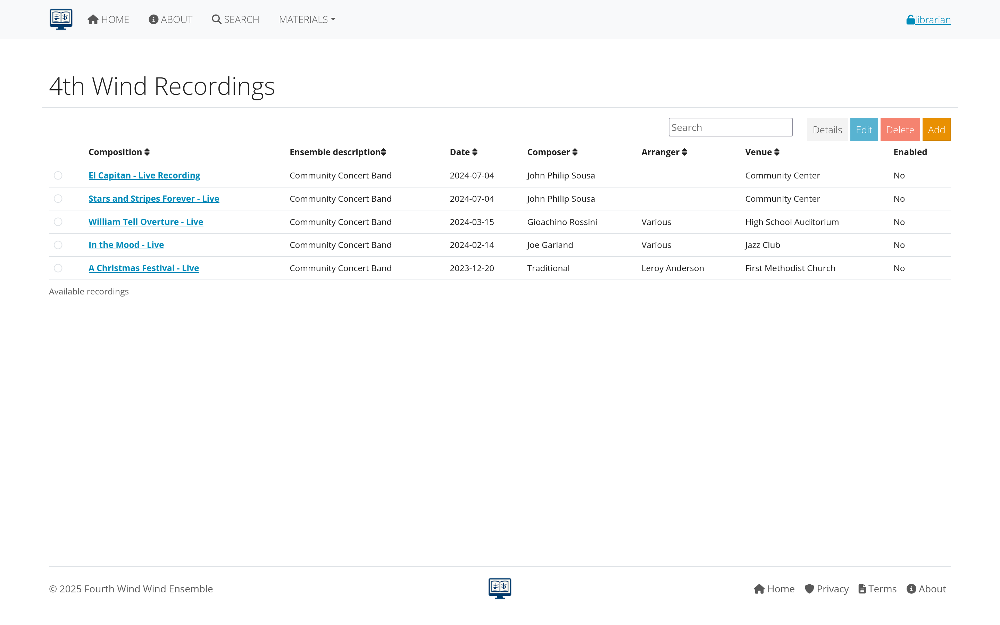

# Concerts and Recordings

This section covers managing concert data, performance history, playgrams, and audio recordings in AllanaCrusis. These features help track your organization's performance history and create valuable archives.

## Table of contents
- [Understanding Performance Tracking](#understanding-performance-tracking)
- [Concert Management](#concert-management)
- [Playgrams](#playgrams)
- [Performance History](#performance-history)
- [Recordings Management](#recordings-management)
- [Integration with Compositions](#integration-with-compositions)
- [Reporting and Analysis](#reporting-and-analysis)

---

## Understanding performance tracking

### what is Performance Tracking?
Performance tracking in AllanaCrusis includes:
- **Concerts**: Individual performance events with dates, venues, and programs
- **Playgrams**: Detailed programs showing what was performed when
- **Performance history**: Complete record of when compositions have been performed
- **Recordings**: Audio/video files linked to performances or compositions

### benefits of Performance Tracking
- **Historical record**: Maintain complete performance archive
- **Programming assistance**: Avoid repeating recent performances
- **Anniversary planning**: Track when pieces were last performed
- **Educational value**: Show students performance tradition
- **Grant reporting**: Document organization activity
- **Marketing materials**: Showcase performance history

*Figure 1: Overview of performance tracking components in AllanaCrusis*

---

## Concert management

### creating a New Concert
1. **Navigate to concerts section** (may be under Materials or Reports)
2. **Click "Add New Concert"**
3. **Fill in concert details**

#### Basic Concert Information
**Required Fields:**
- **Concert title**: "Spring Concert 2025", "Holiday Performance"
- **Date**: Performance date and time
- **Venue**: Location of performance
- **Ensemble**: Performing group

**Optional Fields:**
- **Conductor**: Person leading the performance
- **Description**: Special notes about the concert
- **Season/Series**: If part of a regular series
- **Audience type**: Public, private, educational, etc.

*Figure 2: Form for creating a new concert event*

#### Concert Details
**Venue Information:**
- **Name**: Complete venue name
- **Address**: Full location details
- **Type**: Concert hall, outdoor venue, school, etc.
- **Capacity**: Number of seats (if relevant)

**Performance Context:**
- **Concert type**: Regular concert, festival, competition, etc.
- **Ticket information**: Free, ticketed, fundraiser
- **Special circumstances**: Memorial concert, celebration, etc.

### editing Concert Information
1. **Find the concert** in the concerts list
2. **Click "Edit" button**
3. **Update information** as needed
4. **Save changes**

Common edits include:
- **Date/time changes**: Due to scheduling conflicts
- **Venue updates**: If location changes
- **Program modifications**: As repertoire is finalized
- **Additional details**: Notes added after the event

*Figure 3: Editing existing concert information*

---

## Playgrams

### what are Playgrams?
Playgrams are detailed concert programs that show:
- **Order of performance**: Sequence of pieces in the concert
- **Specific compositions**: Which works were performed
- **Program structure**: Movements, intermissions, encores
- **Additional information**: Soloists, special notes

### creating Playgrams
#### Method 1: Build Program During Concert Creation
1. **While creating/editing a concert**
2. **Add compositions to the program**
3. **Set performance order**
4. **Add program notes**

#### Method 2: Playgram Builder Tool
1. **Access Playgram Builder** (separate tool)
2. **Select concert** to build program for
3. **Search and add compositions**
4. **Arrange in performance order**
5. **Add intermissions and special elements**

*Figure 4: Playgram builder showing program construction*

### program Elements
**Standard Elements:**
- **Musical compositions**: Main repertoire
- **Intermissions**: Breaks in the program
- **Encores**: Additional pieces performed
- **Special features**: Solos, guest performers, narration

**Additional Information:**
- **Program notes**: Background on compositions
- **Personnel**: Soloists, guest conductors
- **Acknowledgments**: Sponsors, special thanks
- **Technical notes**: Special staging, equipment

### playgram Management
**Ordering and Organization:**
- **Drag and drop**: Rearrange program order
- **Numbering**: Automatic or manual sequence numbers
- **Grouping**: Sets, movements, multi-part works
- **Timing**: Estimated or actual performance durations

**Program Validation:**
- **Composition verification**: Ensure pieces exist in library
- **Timing calculations**: Total program length
- **Balance checking**: Variety in programming
- **Historical awareness**: Recent performance checking

*Figure 5: Tools for organizing and validating concert programs*

---

## Performance history

### tracking Performance History
Every time a composition is included in a playgram, it creates a performance record showing:
- **When**: Date of performance
- **Where**: Venue and concert context
- **Who**: Ensemble and conductor
- **Program context**: What else was performed

### viewing Performance History
**For Individual Compositions:**
1. **Go to composition details**
2. **Look for "Performance History" section**
3. **See chronological list** of performances

**For Ensembles:**
1. **Access ensemble performance history**
2. **Filter by date ranges**
3. **Sort by various criteria**

*Figure 6: Performance history showing when and where compositions were performed*

### using Performance History
**Programming Decisions:**
- **Avoid repetition**: See when pieces were last performed
- **Anniversary programming**: Commemorate significant performances
- **Audience consideration**: Balance familiar and new repertoire
- **Educational planning**: Show students performance tradition

**Historical Research:**
- **Repertoire analysis**: What types of music are performed most
- **Conductor preferences**: Different conductors' programming patterns
- **Seasonal patterns**: Holiday music, graduation pieces, etc.
- **Venue considerations**: What works well in different spaces

---

## Recordings management

### types of Recordings
AllanaCrusis can manage various recording types:
- **Live concert recordings**: Full or partial concert audio/video
- **Studio recordings**: Professional recording sessions
- **Reference recordings**: Examples for rehearsal or study
- **Archival recordings**: Historical performances

### adding Recordings
#### Upload Process
1. **Access recordings section**
2. **Click "Add Recording"**
3. **Upload audio/video file** or link to external source
4. **Add recording metadata**

#### Recording Information
**Basic Details:**
- **Title**: Recording description
- **Date**: When recording was made
- **Performers**: Ensemble, conductor, soloists
- **Recording quality**: Professional, amateur, rehearsal, etc.

**Technical Information:**
- **File format**: MP3, WAV, MP4, etc.
- **Quality settings**: Bitrate, resolution
- **Duration**: Length of recording
- **File size**: For storage planning

*Figure 7: Form for adding new recordings with metadata*

#### Linking to Performances
**Concert Recordings:**
- **Link to specific concert**: Connect recording to playgram
- **Partial recordings**: Note which pieces are included
- **Multiple recordings**: Different microphone positions, etc.

**Composition Recordings:**
- **Reference recordings**: Examples of how piece should sound
- **Multiple interpretations**: Different performances of same work
- **Educational use**: Recordings for study and analysis

### recording Organization
**Categories and Tags:**
- **Performance type**: Concert, rehearsal, masterclass
- **Quality level**: Professional, educational, archival
- **Usage permissions**: Public, educational use only, restricted
- **Format specifications**: Audio vs. video, resolution, etc.

**Access Control:**
- **Public recordings**: Available to all users
- **Member only**: Requires login to access
- **Educational use**: Restricted to specific purposes
- **Archive only**: For preservation, not general access

*Figure 8: Interface for organizing and categorizing recordings*

---

## Integration with compositions

### linking Performances to Compositions
When compositions are added to playgrams:
- **Automatic linking**: Performance history updates automatically
- **Bidirectional connections**: View from composition or concert perspective
- **Statistical tracking**: Usage counts and frequency analysis

### enhanced Composition Information
Performance tracking adds valuable context to compositions:
- **Performance frequency**: How often piece is performed
- **Last performance**: When it was most recently played
- **Historical significance**: Important or memorable performances
- **Programming context**: What pieces it's commonly performed with

### programming Analysis
**Repertoire Patterns:**
- **Popular pieces**: Most frequently performed works
- **Forgotten repertoire**: Pieces not performed recently
- **Seasonal trends**: Holiday music, graduation pieces
- **Difficulty analysis**: Grade level vs. performance frequency

**Conductor Analysis:**
- **Programming preferences**: Different conductors' repertoire choices
- **Repertoire development**: How programming evolves over time
- **Guest conductor impact**: Special repertoire for visiting conductors

*Figure 9: Analysis tools showing programming patterns and trends*

---

## Reporting and analysis

### performance Reports
**Standard Reports:**
- **Concert programs**: Formatted programs for printing
- **Performance history**: Chronological lists by composition or date
- **Repertoire analysis**: Statistical breakdown of programming
- **Anniversary reports**: Significant dates and milestones

**Custom Reports:**
- **Date range analysis**: Performance activity in specific periods
- **Venue reports**: What's been performed where
- **Conductor reports**: Programming by different conductors
- **Genre analysis**: Balance of different musical styles

### data Export Options
**Format Options:**
- **PDF programs**: Print-ready concert programs
- **CSV data**: Raw data for external analysis
- **Calendar exports**: Performance dates for scheduling software
- **Web formats**: Online program displays

**Integration Capabilities:**
- **Website integration**: Automatic program publishing
- **Marketing materials**: Performance history for promotion
- **Grant reporting**: Documentation of organizational activity
- **Educational resources**: Historical context for students

*Figure 10: Interface for generating various types of performance reports*

### analytics and Insights
**Trend Analysis:**
- **Programming trends**: How repertoire choices change over time
- **Audience preferences**: Popular vs. less popular works
- **Educational progression**: How difficulty level changes seasonally
- **Historical cycles**: When pieces tend to be revived

**Planning Tools:**
- **Gap analysis**: Repertoire not performed recently
- **Balance checking**: Variety in programming choices
- **Anniversary tracking**: Significant dates and commemorations
- **Venue suitability**: What works well in different spaces

---

## Best practices

### data Quality
**Consistent Entry:**
- **Standardize concert naming**: Use consistent format for concert titles
- **Accurate dates**: Double-check performance dates and times
- **Complete information**: Fill in all available details
- **Regular updates**: Keep information current as plans change

**Verification Process:**
- **Cross-check programs**: Verify against printed programs
- **Confirm recordings**: Ensure recordings match performance data
- **Update after events**: Add actual information after concerts
- **Historical verification**: Research accuracy of older entries

### organization Strategy
**Systematic Approach:**
- **Regular data entry**: Update system consistently
- **Batch processing**: Handle multiple concerts efficiently
- **Backup planning**: Protect performance history data
- **Access management**: Control who can edit performance data

**Long-term Planning:**
- **Historical preservation**: Maintain complete archives
- **Migration planning**: Ensure data survives system changes
- **Integration goals**: Connect with other organizational systems
- **Educational value**: Make archives useful for learning

*Figure 11: Checklist for maintaining quality performance data*

---

## Troubleshooting

### common Issues
**Missing Performance Data:**
- **Incomplete playgrams**: Some compositions not linked to performances
- **Date errors**: Incorrect or missing performance dates
- **Venue confusion**: Performance location not clearly identified

**Recording Problems:**
- **File access issues**: Recordings not playing or downloading
- **Quality concerns**: Poor audio or video quality
- **Storage limitations**: Files too large for system capacity
- **Permission problems**: Access restrictions not working properly

**Integration Difficulties:**
- **Composition linking**: Performances not connecting to correct compositions
- **Duplicate entries**: Same performance entered multiple times
- **Data inconsistency**: Information conflicts between different records

### solutions and Workarounds
**Data Correction:**
- **Systematic review**: Regular audits of performance data
- **Correction procedures**: Standard process for fixing errors
- **Verification sources**: Use programs, recordings, and other documents
- **Change documentation**: Track what corrections were made and why

**System Optimization:**
- **File management**: Organize recordings efficiently
- **Performance tuning**: Optimize database for performance queries
- **User training**: Ensure consistent data entry practices
- **Backup procedures**: Protect against data loss

---

## Next steps

With performance tracking properly set up:

1. **[Learn Distribution](distribution.html)** - Share materials with performers and audiences
2. **[Explore Admin Functions](admin-guide.html)** - Advanced management and reporting tools
3. **[Review Troubleshooting](troubleshooting.html)** - Handle common issues and problems

---

*Continue to the next section: [Part Distribution](distribution.html) to learn about sharing musical materials with users.*