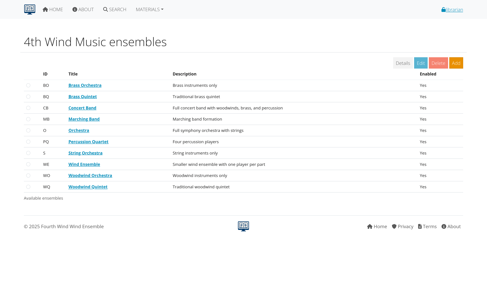

# Distributing parts

This section covers how to share musical parts with performers, students, and other users through AllanaCrusis's distribution systems. Learn about digital downloads, access control, and managing the distribution process.

## Table of contents
- [Describing Distribution](#describing-distribution)
- [Digital File Distribution](#digital-file-distribution)
- [Access Control and Permissions](#access-control-and-permissions)
- [Download Management](#download-management)
- [Physical Distribution Tracking](#physical-distribution-tracking)
- [User Experience](#user-experience)
- [Monitoring and Analytics](#monitoring-and-analytics)

---

## Describing distribution

### what is Part Distribution?
Part distribution in AllanaCrusis includes:
- **Digital downloads**: PDF and other file formats accessible online
- **Access control**: Managing who can download what materials
- **Physical tracking**: Monitoring physical parts checked out to users
- **Usage analytics**: Understanding how materials are being used

### distribution Methods
**Digital Distribution:**
- **Direct downloads**: Users download files directly from AllanaCrusis
- **Email distribution**: Send files via email to specific users
- **Link sharing**: Temporary or permanent links to files
- **Bulk distribution**: Multiple files or complete sets

**Physical Distribution:**
- **Check-out system**: Track who has physical parts
- **Part sets**: Pre-organized collections for specific groups
- **Rental tracking**: Manage lending to external organizations
- **Return management**: Monitor and enforce return of materials

*Figure 1: Overview of distribution methods in AllanaCrusis*

### benefits of Organized Distribution
- **Efficiency**: Streamlined process for getting music to performers
- **Security**: Control access to copyrighted materials
- **Tracking**: Know who has what materials and when
- **Convenience**: 24/7 access to digital materials
- **Cost savings**: Reduce copying and mailing costs
- **Environmental impact**: Less paper usage with digital distribution

---

## Digital file distribution

### setting Up Digital Files
Before distribution, ensure files are properly prepared:

#### File Preparation
1. **Upload files** to individual parts (see [Parts Management](parts.html#file-management))
2. **Set file descriptions** for clarity
3. **Verify file quality** - clear, complete, readable
4. **Test downloads** to ensure files work properly

#### File Organization
**Naming Conventions:**
- **Descriptive names**: Include composer, title, and instrument
- **Consistent format**: "Composer-Title-Instrument.pdf"
- **Version control**: Note edition or arrangement version
- **Date stamps**: Include creation or revision dates

**Quality Standards:**
- **Resolution**: 300 DPI minimum for clear reading
- **File size**: Balance quality with download speed
- **Completeness**: All pages included and in correct order
- **Format consistency**: Standardize on PDF for most parts

*Figure 2: Interface for preparing files for distribution*

### distribution Interfaces
**User-Facing Download Pages:**
- **Composition overview**: Shows all available parts
- **Individual part pages**: Detailed information and download links
- **Search integration**: Find and download in one process
- **Mobile optimization**: Works on phones and tablets

**Download Process:**
1. **User finds composition** through search or browse
2. **Selects specific part** needed
3. **Clicks download link** (if authorized)
4. **File downloads** directly to user's device
5. **Usage logged** for tracking and analytics

### batch Distribution
**Complete Part Sets:**
- **Zip file creation**: Bundle all parts for a composition
- **Organized folders**: Parts grouped by instrument family
- **Custom selections**: User chooses specific parts needed
- **Conductor materials**: Scores and reference materials included

**Distribution Lists:**
- **Ensemble members**: All parts for specific group
- **Section leaders**: Parts for their instrument sections
- **Guest performers**: Specific parts for visiting musicians
- **Educational use**: Student parts for classes

*Figure 3: Interface for creating and managing batch distributions*

---

## Access control and permissions

### permission Levels
AllanaCrusis typically offers several access levels:

#### Public Access
- **No login required**: Anyone can download
- **Public domain works**: Older compositions with expired copyrights
- **Promotional materials**: Pieces being promoted or showcased
- **Educational examples**: Materials for demonstration purposes

#### Member Access
- **Login required**: Must have user account
- **Organization members**: People affiliated with your group
- **Verified users**: Email verification completed
- **Active accounts**: Current and up-to-date memberships

#### Restricted Access
- **Specific permissions**: Granted on individual basis
- **Role-based access**: Librarians, conductors, section leaders
- **Time-limited access**: Temporary permissions for specific needs
- **Conditional access**: Based on agreements or payments

#### Internal Only
- **Staff access**: Librarians and administrators only
- **Work in progress**: Materials not ready for general distribution
- **Sensitive materials**: Restricted for legal or policy reasons
- **Archive materials**: Preserved but not actively distributed

*Figure 4: Configuration interface for setting access permissions*

### copyright and Legal Considerations
**Copyright Compliance:**
- **Publisher permissions**: Verify rights to distribute digitally
- **Fair use guidelines**: Educational and organizational use limitations
- **Attribution requirements**: Credit composers, arrangers, publishers
- **Usage restrictions**: Limit distribution to authorized users

**License Management:**
- **Rental agreements**: Temporary access for specific performances
- **Educational licenses**: Special terms for schools and students
- **Organizational licenses**: Permissions specific to your group
- **Digital rights**: Separate permissions for electronic distribution

### setting Permissions
**For Individual Files:**
1. **Edit part record**
2. **Locate file permissions section**
3. **Select appropriate access level**
4. **Add specific restrictions** if needed
5. **Save changes**

**For Bulk Changes:**
1. **Select multiple parts** or compositions
2. **Use bulk edit tools**
3. **Apply permission changes** to all selected items
4. **Review and confirm** changes

*Figure 5: Interface for setting and managing file permissions*

---

## Download management

### download Tracking
AllanaCrusis automatically tracks download activity:
- **Who**: User account downloading
- **What**: Specific file or composition
- **When**: Date and time of download
- **How many**: Number of downloads per user/file
- **From where**: IP address and location (if available)

### download Controls
**Rate Limiting:**
- **Prevent abuse**: Limit downloads per user per time period
- **Bandwidth management**: Control server load
- **Fair access**: Ensure availability for all users
- **Security**: Prevent automated downloading

**Expiring Links:**
- **Time-limited access**: Links expire after set period
- **One-time downloads**: Single-use download links
- **Event-specific access**: Access only during relevant time periods
- **Emergency revocation**: Ability to immediately disable access

*Figure 6: Dashboard showing download activity and controls*

### user Download Experience
**Simple Process:**
1. **Search for composition** or browse library
2. **View available parts** for the piece
3. **Click download** for needed parts
4. **File downloads** automatically
5. **Confirmation message** appears

**Enhanced Features:**
- **Download history**: Users can see their previous downloads
- **Favorites/Bookmarks**: Save frequently accessed compositions
- **Collection building**: Gather parts for specific performances
- **Mobile access**: Download directly to phones/tablets

### troubleshooting Downloads
**Common Issues:**
- **File won't download**: Check permissions and file existence
- **Slow downloads**: Monitor file sizes and server performance
- **Corrupted files**: Verify file integrity and re-upload if needed
- **Access denied**: Review user permissions and account status

**Solutions:**
- **Alternative formats**: Provide multiple file format options
- **Direct links**: Bypass browser download issues
- **Support contact**: Clear process for getting help
- **Status updates**: Inform users of system issues or maintenance

---

## Physical distribution tracking

### check-Out System
While AllanaCrusis primarily focuses on digital distribution, it can also track physical materials:

#### Physical Part Management
**Check-Out Process:**
1. **User requests physical parts**
2. **Librarian verifies availability**
3. **Parts marked as checked out** in system
4. **Due date set** for return
5. **User receives** physical materials

**Return Tracking:**
- **Due date monitoring**: Track when parts should be returned
- **Condition assessment**: Note any damage upon return
- **Overdue notifications**: Automatic reminders for late returns
- **Replacement handling**: Process for lost or damaged parts

*Figure 7: Interface for tracking physical part distribution*

#### Part Sets and Collections
**Pre-organized Sets:**
- **Performance sets**: Complete parts for specific concerts
- **Educational sets**: Materials for classes or workshops
- **Rental sets**: Collections available for lending
- **Study sets**: Reference materials for research

**Set Management:**
- **Inventory tracking**: Know what's in each set
- **Availability calendar**: Schedule set usage
- **Maintenance scheduling**: Regular cleaning and organization
- **Replacement planning**: Update sets as materials wear out

### integration with Digital
**Hybrid Distribution:**
- **Digital + physical options**: Users choose preferred format
- **Backup systems**: Physical parts when digital isn't available
- **Special needs**: Large print, braille, or other accessibility formats
- **Performance support**: Digital for practice, physical for performance

---

## User experience

### user Interface Design
**Intuitive Access:**
- **Clear navigation**: Easy to find desired compositions
- **Search functionality**: Multiple ways to locate materials
- **Filter options**: Narrow results by instrument, genre, etc.
- **Mobile responsive**: Works well on all devices

**Download Process:**
- **One-click downloads**: Minimal steps to get files
- **Progress indicators**: Show download status
- **Error handling**: Clear messages when problems occur
- **Help resources**: Guidance for using the system

*Figure 8: User-friendly interface for accessing and downloading parts*

### user Support
**Self-Service Options:**
- **FAQ section**: Common questions and answers
- **Video tutorials**: Visual guides for using the system
- **Help documentation**: Detailed instructions
- **System status**: Information about outages or issues

**Direct Support:**
- **Contact information**: How to reach librarians or administrators
- **Request system**: Formal process for requesting materials
- **Feedback mechanism**: Users can report problems or suggestions
- **Training sessions**: Group instruction for new users

### accessibility Features
**Universal Design:**
- **Screen reader compatibility**: Works with assistive technology
- **Keyboard navigation**: Full functionality without mouse
- **High contrast options**: Better visibility for some users
- **Large text support**: Scalable fonts and interfaces

**Special Needs:**
- **Alternative formats**: Large print, braille, simplified layouts
- **Audio descriptions**: Voice guidance for navigation
- **Customizable interface**: User preferences for display
- **Mobile accessibility**: Touch-friendly controls

---

## Monitoring and analytics

### usage Statistics
**Download Analytics:**
- **Popular materials**: Most frequently downloaded compositions
- **User patterns**: When and how people access materials
- **Geographic distribution**: Where downloads are coming from
- **Device analysis**: Desktop vs. mobile usage patterns

**Performance Metrics:**
- **Download success rates**: How often downloads complete successfully
- **User satisfaction**: Feedback and ratings from users
- **System performance**: Speed and reliability of downloads
- **Support requests**: Types and frequency of user problems

*Figure 9: Analytics dashboard displaying distribution statistics*

### reporting Capabilities
**Standard Reports:**
- **Usage summaries**: Overall activity and trends
- **User activity**: Individual user download history
- **Material popularity**: Rankings of most accessed items
- **System performance**: Technical metrics and reliability

**Custom Reports:**
- **Date range analysis**: Activity during specific periods
- **User group reports**: Usage by different types of users
- **Material-specific**: Detailed analysis for particular compositions
- **Comparative studies**: Usage patterns over time

### data-Driven Decisions
**Collection Development:**
- **Popular vs. unused**: Identify materials to prioritize or retire
- **Format preferences**: Digital vs. physical usage patterns
- **Access patterns**: When and how users need materials
- **Gap analysis**: Missing materials that users request

**System Improvements:**
- **Performance optimization**: Address slow download issues
- **Interface enhancements**: Improve based on user behavior
- **Feature development**: Add capabilities users actually need
- **Infrastructure planning**: Scale systems based on usage growth

---

## Best practices

### distribution Strategy
**Organized Approach:**
- **Clear policies**: Establish rules for access and usage
- **Consistent processes**: Standardize distribution procedures
- **Regular maintenance**: Keep files and permissions current
- **User education**: Train users on proper system usage

**Quality Assurance:**
- **File verification**: Regular checks of file quality and availability
- **Permission audits**: Review and update access controls
- **User feedback**: Listen to user experiences and suggestions
- **System testing**: Regular verification that everything works

### security and Compliance
**Copyright Protection:**
- **Access controls**: Restrict distribution to authorized users
- **Usage monitoring**: Track how materials are being used
- **License compliance**: Follow publisher agreements
- **Audit trails**: Maintain records of distribution activity

**Data Security:**
- **User privacy**: Protect personal information and usage data
- **Secure transmission**: Encrypt downloads and communications
- **Access logging**: Monitor who accesses what materials
- **Backup procedures**: Protect against data loss

*Figure 10: Checklist for maintaining effective distribution systems*

---

## Troubleshooting

### common Distribution Problems
**Technical Issues:**
- **Files won't download**: Check permissions, file integrity, server status
- **Slow performance**: Monitor bandwidth usage and server load
- **Mobile problems**: Test interface on different devices and browsers
- **Access errors**: Verify user accounts and permission settings

**User Issues:**
- **Can't find materials**: Improve search and navigation
- **Don't understand permissions**: Clarify access policies
- **Mobile difficulties**: Optimize mobile experience
- **Quality complaints**: Review file preparation standards

### solutions and Improvements
**System Optimization:**
- **Performance tuning**: Improve download speeds and reliability
- **Interface refinement**: Make navigation more intuitive
- **Mobile enhancement**: Better mobile user experience
- **Integration improvement**: Connect better with other systems

**User Support:**
- **Better documentation**: Clearer instructions and help materials
- **Training programs**: Group and individual instruction
- **Feedback systems**: Regular collection of user input
- **Proactive communication**: Keep users informed of changes and issues

---

## Next steps

With distribution properly configured:

1. **[Learn Admin Functions](admin-guide.html)** - Advanced management and system administration
2. **[Review Troubleshooting](troubleshooting.html)** - Handle common issues and problems
3. **[Explore Analytics](admin-guide.html#reporting-and-analytics)** - Use data to improve your library

---

*Continue to the next section: [Administrator Guide](admin-guide.html) to learn about advanced system management and administration.*