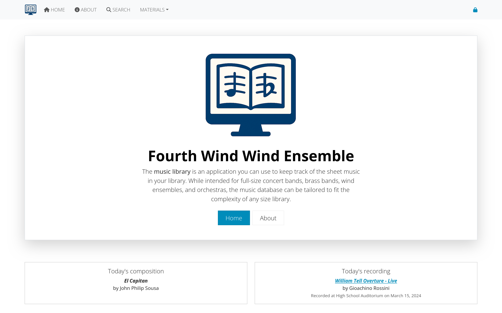

# Getting access to AllanaCrusis

This section covers user registration, account management, and understanding the different user roles and permissions in AllanaCrusis.

## Table of contents
- [User Registration](#user-registration)
- [User Roles and Permissions](#user-roles-and-permissions)
- [Login Process](#login-process)
- [Email Verification](#email-verification)
- [Password Management](#password-management)
- [Account Settings](#account-settings)

---

## User registration

### how to get an account
User accounts are typically created by:
1. **System administrators** - for organizational members
2. **Self-registration** - if enabled by your organization
3. **Invitation system** - through email invitations

### registration process
If self-registration is available:

1. **Click "Register"** on the login page
2. **Fill out the registration form**:
   - Username (unique identifier)
   - Email address
   - Password (meeting security requirements)
   - Full name
   - Organization affiliation (if applicable)

3. **Submit the form**
4. **Check your email** for verification message
5. **Click the verification link**
6. **Account is now active**

*Figure 1: User registration form with required information*

### registration Requirements
- **Valid email address**: Must be accessible for verification
- **Strong password**: Usually 8+ characters with mixed case and numbers
- **Unique username**: Cannot duplicate existing users
- **Organization approval**: May require administrator approval

---

## User roles and permissions

AllanaCrusis uses a role-based permission system with four main user types:

### guest User (No Account Needed)
**What Guests Can Do:**
- View public compositions and information
- Use basic search functionality
- Browse publicly available content
- Read about the organization and system

**What Guests Cannot Do:**
- Download files
- Edit any content
- Access member-only features
- View private compositions

*Figure 2: Interface view for guest users*

### member
**Additional Permissions:**
- Access to part downloads (if enabled)
- View contact information
- Access member-only compositions
- Use advanced search features
- View detailed composition information

**Typical Users:**
- Ensemble members
- Students
- Community musicians
- General library users

*Figure 3: Enhanced interface for logged-in members*

### librarian
**Full Library Management:**
- Add, edit, and delete compositions
- Manage parts and instrumentation
- Upload and organize files
- Create and edit supporting data
- Access all content management functions
- Generate reports and analytics

**Cannot Do:**
- User management (add/remove users)
- System configuration changes
- Access administrative settings

**Typical Users:**
- Music librarians
- Ensemble managers
- Content administrators

*Figure 4: Librarian interface with content management tools*

### manager
**Complete System Control:**
- All librarian permissions
- User management (add, edit, delete users)
- System configuration access
- Administrative settings
- Security and access control
- System maintenance functions

**Typical Users:**
- System administrators
- Organization leadership
- IT staff
- Primary librarians

*Figure 5: Manager interface with full administrative access*

---

## Login process

### standard Login
1. **Navigate to the login page**
2. **Enter your username or email**
3. **Enter your password**
4. **Click "Login"**

### login Troubleshooting
**Common Issues:**
- **Incorrect credentials**: Check username/email and password
- **Account not verified**: Check email for verification link
- **Account disabled**: Contact your administrator
- **Forgotten password**: Use password reset feature

*Figure 6: Standard login form*

### session Management
- **Automatic logout**: After period of inactivity
- **Remember me**: Option to stay logged in longer
- **Multiple devices**: Can be logged in on different devices
- **Security alerts**: Notifications for unusual activity

---

## Email verification

### why Email Verification is Required
- **Security**: Confirms you own the email address
- **Communication**: Ensures you receive important notifications
- **Password reset**: Enables secure password recovery
- **Account recovery**: Helps with lost account access

### verification Process
1. **Register your account** or request verification
2. **Check your email** (including spam/junk folders)
3. **Click the verification link** in the email
4. **Confirmation page** appears
5. **Account is now verified** and fully active

*Figure 7: Email verification message and confirmation*

### troubleshooting Email Verification
**If you don't receive the email:**
- Check spam/junk folders
- Verify email address is correct
- Request a new verification email
- Contact administrator if problems persist

**If the link doesn't work:**
- Try copying and pasting the full URL
- Check if the link has expired
- Request a new verification email
- Use a different browser

---

## Password management

### password Requirements
Most systems require:
- **Minimum 8 characters**
- **Mix of uppercase and lowercase letters**
- **At least one number**
- **Special characters** (optional but recommended)
- **Not a common password** or dictionary word

### password Reset Process
**If you forget your password:**

1. **Click "Forgot Password"** on the login page
2. **Enter your email address**
3. **Check your email** for reset instructions
4. **Click the reset link** in the email
5. **Enter your new password** (twice for confirmation)
6. **Submit the form**
7. **Login with your new password**

*Figure 8: Password reset request and new password form*

### changing Your Password
**To change your password while logged in:**

1. **Go to Account Settings** (usually in user menu)
2. **Click "Change Password"**
3. **Enter current password**
4. **Enter new password** (twice)
5. **Save changes**
6. **Confirmation message** appears

### password Security Tips
- **Use unique passwords** for each system
- **Consider a password manager**
- **Don't share passwords** with others
- **Change passwords regularly**
- **Use two-factor authentication** if available

---

## Account settings

### profile Information
You can typically update:
- **Display name**
- **Email address** (may require re-verification)
- **Contact information**
- **Notification preferences**
- **Time zone and locale settings**

### notification Settings
Control what emails you receive:
- **System announcements**
- **New composition notifications**
- **Account security alerts**
- **Password expiration warnings**
- **Weekly/monthly summaries**

*Figure 9: Account settings with profile and notification options*

### privacy Settings
Depending on your organization:
- **Profile visibility** to other users
- **Contact information sharing**
- **Activity tracking** preferences
- **Data retention** settings

---

## Getting help with access issues

### common Problems and Solutions

**Can't create an account:**
- Check if registration is open to your organization
- Verify email domain is allowed
- Contact administrator for invitation

**Account locked or disabled:**
- Contact your system administrator
- May be due to multiple failed login attempts
- Could be administrative action requiring review

**Email not working:**
- Update email address in account settings
- Check with IT about email delivery issues
- Verify your email system accepts external emails

### who to Contact
- **Technical issues**: System administrator
- **Account permissions**: Librarian or manager
- **Organization policies**: Administrative staff
- **General questions**: User documentation or help desk

---

## Next steps

Once you have access:

1. **[Learn about Supporting Data](supporting-data.html)** - Understand the organizational structure
2. **[Explore Compositions](compositions.html)** - See how musical works are managed
3. **[Try Advanced Search](getting-started.html#basic-search)** - Use your member access for enhanced features

---

*Continue to the next section: [Supporting Data](supporting-data.html) to learn about instruments, ensembles, and organizational setup.*