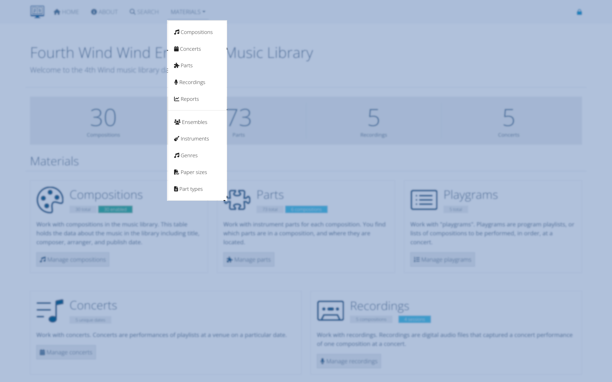

# Getting started with AllanaCrusis

This guide will help you understand the AllanaCrusis interface and basic functionality. Whether you're new to the system or need a refresher, start here to get oriented.

## Table of contents
- [System requirements](#system-requirements)
- [First visit](#first-visit)
- [Home page overview](#home-page-overview)
- [Navigation](#navigation)
- [Interface elements](#interface-elements)
- [Getting help](#getting-help)

---

## System requirements

### Web browser
AllanaCrusis works best with modern web browsers, and uses your stable internet connection.

---

## First visit

### Accessing the system
1. Open your web browser.
2. Navigate to your organization's AllanaCrusis URL.
3. You'll see the public welcome page with basic information and a randomly selected composition and recording.

*Figure 1: Welcome page*

### What you can do without logging in
- Browse public compositions, concerts, recordings, and some supporting data
- Use basic search functionality
- View general information about the library
- Read about the system and organization

*Figure 2: Public homepage view*

## Home page overview

*Figure 4: Home page with feature information and updates*

### Welcome section
The homepage provides:
- Quick overview of the music library
- Recent additions or featured compositions
- Links to commonly used sections
- Contact information

### Navigation bar
The top navigation includes:
- **Home**: Return to main page
- **Search**: Global search functionality
- **About**: Information about the system and organization
- **Login/Register**: Access control

### Quick stats
- Total compositions in the library
- Number of different ensembles
- Recent activity summary

---

## Navigation

### Main menu structure
The navigation is organized into logical sections:

#### Public areas (available to everyone)
- **Home**: Main dashboard
- **Search**: Composition lookup
- **About**: System and organization information

#### Member areas (login required)
- **Materials**: Compositions, parts, instruments
- **Reports**: Advanced search and analytics
- **Admin**: User management (managers only)

### Breadcrumb navigation
- Shows your current location in the system
- Click any level to navigate back
- Helps you understand the page hierarchy

### User status indicator
The top right shows:
- Your login status
- Current user role
- Quick access to logout

*Figure 7: Main navigation menu with user status*

---

## Interface elements

### Color coding
AllanaCrusis uses consistent color coding:
- **Blue buttons**: Edit or view actions
- **Green buttons**: Add or create actions
- **Red buttons**: Delete or remove actions
- **Gray buttons**: Cancel or neutral actions

### Tables and lists
- **Sortable columns**: Click headers to sort
- **Filter boxes**: Type to filter results in real-time
- **Sticky headers**: Headers stay visible while scrolling
- **Pagination**: Navigate through large datasets

### Forms
- **Required fields**: Marked with asterisks (*)
- **Validation**: Real-time feedback on form entries
- **Autocomplete**: Helpful suggestions for common fields
- **Save indicators**: Clear feedback when data is saved

---

## Getting help

### Built-in help
- **Tooltips**: Hover over elements for quick help
- **Field descriptions**: Explanatory text for complex fields
- **Error messages**: Clear guidance when something goes wrong

### Documentation
- **User Guide sections**: Detailed instructions for each area
- **Video tutorials**: Step-by-step visual guides (if available)
- **FAQ**: Common questions and answers

### support resources
- **System Administrator**: For technical issues
- **Librarian**: For content and process questions
- **User Community**: Other users in your organization

---

## Next steps

Now that you understand the basics:

1. **[Get access](getting-access.html)** - Learn about user accounts and roles
2. **[Explore search](search.html)** - Discover search capabilities and techniques
3. **[View compositions](compositions.html)** - See how musical works are organized

---

*Continue to the next section: [Getting Access](getting-access.html) to learn about user accounts and permissions.*