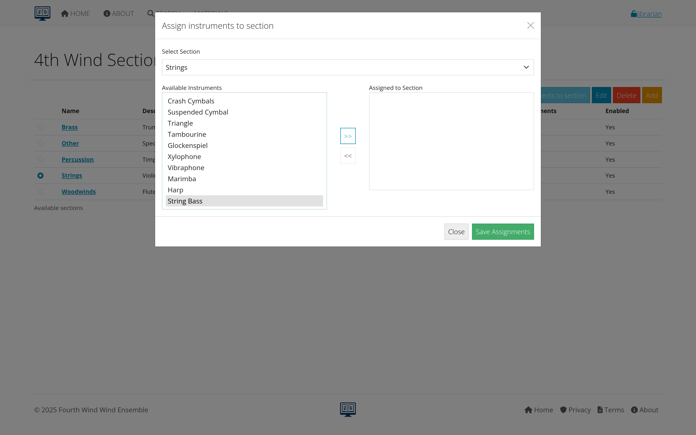

# Instrumentation Management

This section covers setting up instrumentation for compositions, which defines what instrument parts are needed for each musical work. Instrumentation setup is typically done once per composition and creates the foundation for individual part management.

## Table of contents
- [Understanding instrumentation](#understanding-instrumentation)
- [Setting up instrumentation](#setting-up-instrumentation)
- [Finding instrumentation information](#finding-instrumentation-information)
- [Next steps](#next-steps)

---

## Understanding instrumentation

### What is instrumentation?
Instrumentation defines which instrument parts are required for a musical composition:
- **Complete part list**: All instruments needed for performance
- **Part relationships**: How individual parts relate to the composition
- **Foundation for parts**: Creates individual part records for management

### Instrumentation vs. individual parts
- **Instrumentation**: The overall list of what instruments are needed
- **Individual parts**: Specific management of each part (files, inventory, etc.)
- **Workflow**: Set up instrumentation first, then manage individual parts

*Figure 1: How instrumentation relates to compositions and individual parts*

### Types of parts in instrumentation
- **Individual instruments**: Specific to one instrument (Flute 1, Trumpet 2)
- **Condensed parts**: Multiple instruments on one part (Flute 1&2)
- **Rhythm section**: Special parts for jazz or contemporary music
- **Conductor materials**: Scores, piano reductions
- **Auxiliary materials**: Program notes, technical requirements

---

## Setting up instrumentation

### Adding instrumentation to a composition
Before managing individual parts, you need to set up the instrumentation for a composition.

#### Step 1: Access instrumentation
1. **Find your composition** in the compositions list
2. **Click "Instrumentation"** button or link
3. **Review existing instrumentation** (if any)

#### Step 2: Set basic information
- **Confirm composition details**: Title, catalog number, paper size
- **Set average page count**: Estimate for most parts in the piece
- **Choose default paper size**: Usually Folio (9x12) for band music

*Figure 2: Initial instrumentation setup for a composition*

#### Step 3: Select required instruments
1. **Review available instruments** in the selection list
2. **Select all parts present in the composition**:
   - Check the score for complete instrumentation
   - Look through physical parts if available
   - Use file copies set if one exists

3. **Multi-select techniques**:
   - Hold Ctrl (Windows) or Cmd (Mac) while clicking
   - Select multiple instruments at once
   - Be thorough - missing parts cause problems later

*Figure 3: Selecting instruments for composition instrumentation*

#### Step 4: Add parts to composition
1. **Review selected instruments**
2. **Click "Add Parts"**
3. **System creates individual part records**
4. **Confirmation of parts created**

---

## Finding instrumentation information

### Sources for instrumentation
- **Front of score**: Many pieces list instrumentation
- **Physical part folders**: Check what parts exist
- **Publisher websites**: Often list complete instrumentation
- **Wind Repertory Project**: Detailed instrumentation data
- **File copies sets**: Pre-organized part collections

### Common instrumentation challenges
- **Missing information**: Score may not list all parts
- **Special instruments**: Unusual or optional parts
- **Multiple versions**: Different editions may have different instrumentation
- **Percussion complexity**: Many instruments on percussion parts

---

## Next steps

With instrumentation properly set up:

1. **[Learn Individual Parts Management](parts.html)** - Manage files, inventory, and details
2. **[Explore Concert Management](concerts-recordings.html)** - Track performances
3. **[Review Distribution](distribution.html)** - Share parts with users

---

*Continue to the next section: [Parts Management](parts.html) to learn about managing individual instrument parts and files.*