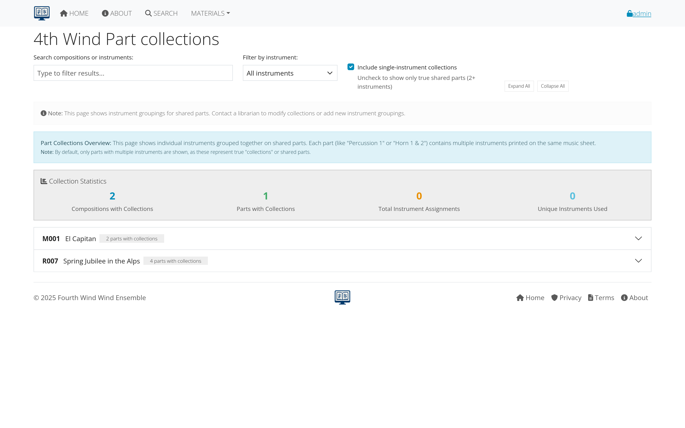
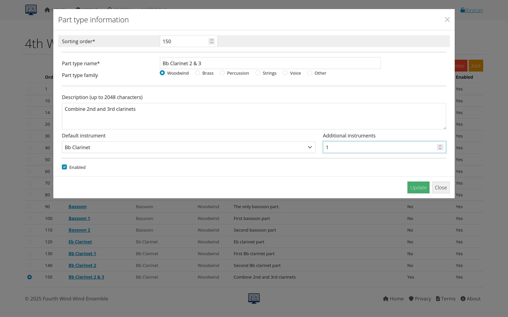
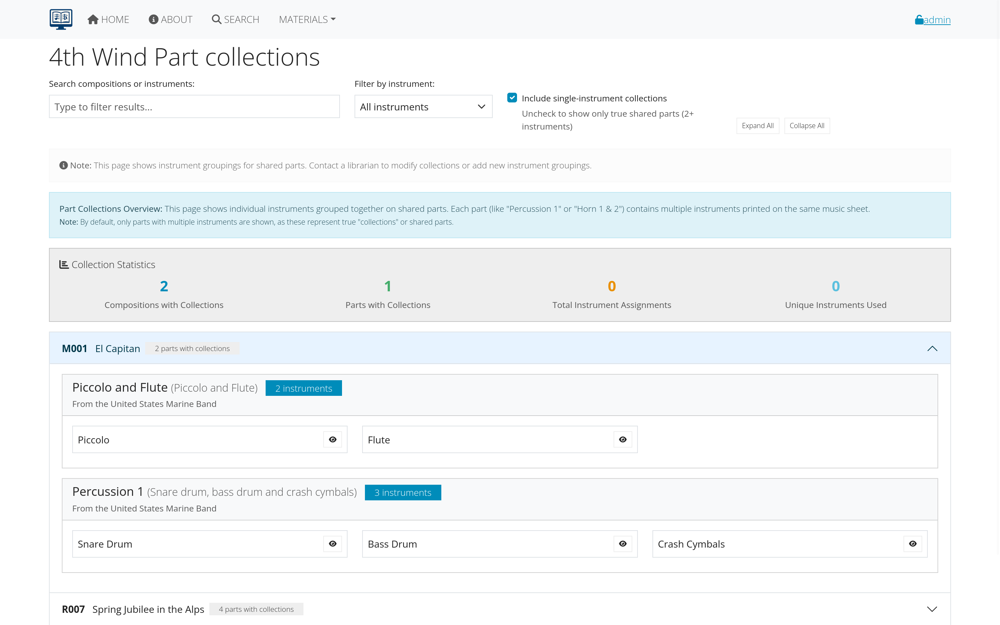
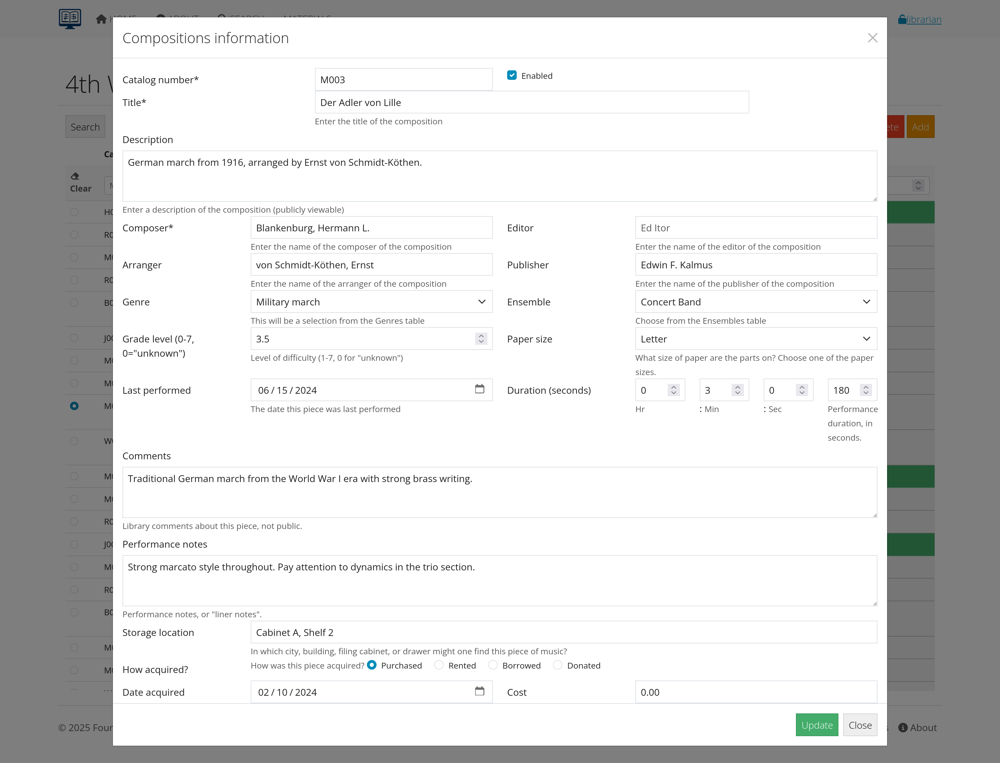
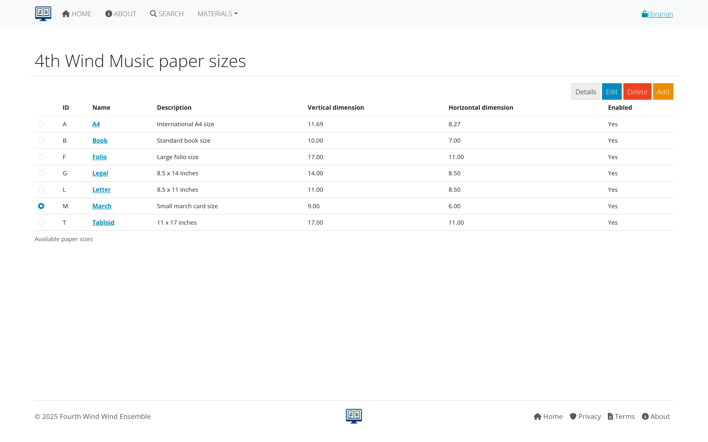
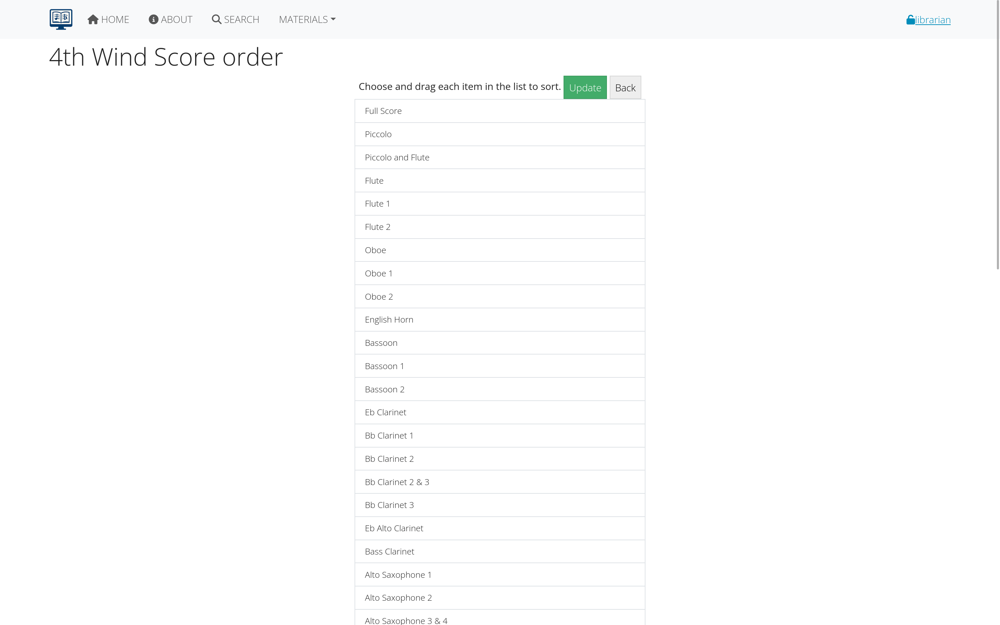
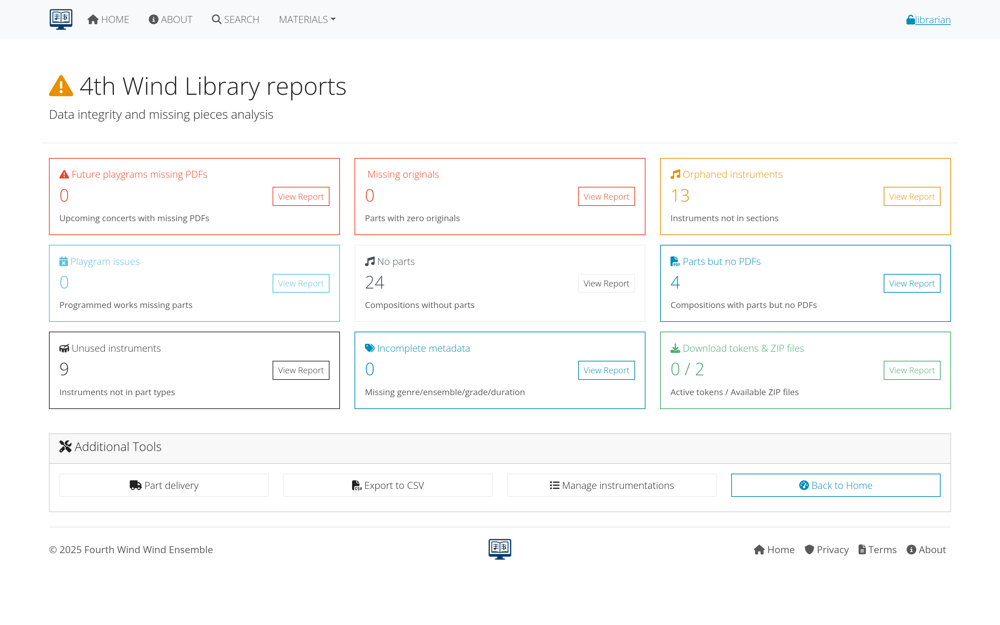

# Managing individual parts

This section covers managing individual instrument parts after instrumentation has been set up, including editing part details, file uploads, physical inventory, and organizing materials.

## Table of contents
- [Describing individual parts](#describing-individual-parts)
- [Managing parts](#managing-parts)
- [Managing files](#managing-files)
- [Physical inventory](#physical-inventory)
- [Part collections](#part-collections)
- [Quality control](#quality-control)
- [Workflow integration](#workflow-integration)
- [Troubleshooting](#troubleshooting)
- [Advanced features](#advanced-features)

---

## Describing individual parts

### What are individual parts?
Individual parts are specific instrument components that have been created through instrumentation setup:
- **Specific instruments**: Flute 1, Trumpet 2, Percussion, etc.
- **Physical tracking**: Count of original printed parts
- **Digital files**: PDF or other electronic formats
- **Metadata**: Page counts, paper sizes, descriptions

### Prerequisites
Before managing individual parts, you must:
- **Complete instrumentation setup**: Parts must be created first
- **Have librarian access**: Required for editing part details
- **Know your physical inventory**: Understand what parts actually exist

*For instrumentation setup, see: [Instrumentation Management](instrumentation.html)*
---

## Managing parts

### accessing Parts List
1. **Go to MATERIALS > Parts**
2. **Find your composition** (sorted by catalog number)
3. **Click composition title** to see parts list
4. **Each part has an "Edit" button**

*Figure 1: List of parts for a specific composition*

### editing Individual Parts
Click the **blue "Edit" button** for any part to access detailed management:

#### Basic Part Information
- **Part name**: Usually set automatically from instrument
- **Paper size**: Specific to this part (may differ from composition default)
- **Page count**: Actual pages for this specific part
- **Part type**: Individual part, condensed score, etc.

#### Physical Inventory Tracking
**Originals Count**
- **Enter "1"** for each part you actually have in the folder
- **Enter "0"** for missing parts that should be there
- **Default is usually "1"** but verify against physical materials

**Part Condition**
- **Description field**: Note condition of physical parts
- **Common notes**: "Pencil markings", "Torn pages", "Deckle-edged"
- **Missing pages**: Note specific page issues
- **Quality concerns**: Anything affecting usability

*Figure 2: Editing form for an individual part*

#### Instrument Assignment
**Primary Instrument**
- **Default assignment**: Usually correct based on part name
- **Verify accuracy**: Especially for percussion and special parts
- **Marked with asterisk**: Shows the primary assignment

**Multiple Instruments on One Part**
Common for percussion parts labeled:
- "Percussion 1", "Mallet Percussion", "Auxiliary Percussion"

**Process for multi-instrument parts:**
1. **Add all instruments** that appear on the part
2. **Hold Ctrl/Cmd** to select multiple instruments
3. **Be specific**: Include all instruments actually used
4. **Optional description**: List instruments in description field

*Figure 3: Assigning multiple instruments to a single part*

#### Special Part Handling
**Doubled Parts (e.g., Flute 1 & 2)**
- **Add same instrument twice** to the instruments list
- **Shows two instances** of the same instrument
- **Reflects actual part content**

**Percussion Parts**
- **Most complex assignments**: Often include many instruments
- **Check throughout the part**: Instruments may appear in different movements
- **Common instruments**: Snare drum, bass drum, crash cymbals, triangle, etc.
- **Ask for help**: Consult percussionists or experienced librarians

**Condensed Parts**
- **Multiple instruments on one part**: Common in older or simplified arrangements
- **Assign all relevant instruments**
- **Note in description**: "Condensed part for Clarinet 1 & 2"

---

## Managing files

### digital File Types
AllanaCrusis typically handles:
- **PDF files**: Most common for sheet music
- **Image files**: Scanned parts (JPEG, PNG)
- **Audio files**: Reference recordings (MP3, WAV)
- **Other formats**: As supported by your system

### uploading Files
1. **Access part editing form**
2. **Look for file upload section**
3. **Choose file from computer**
4. **Add file description** (optional but helpful)
5. **Set access permissions** (who can download)
6. **Upload file**

*Figure 4: Uploading digital files for parts*

### file Organization Best Practices
**Naming Conventions**
- **Descriptive names**: Include composition and instrument
- **Consistent format**: "Composer-Title-Instrument.pdf"
- **Version control**: Include edition or version info if relevant

**Quality Standards**
- **Resolution**: High enough for clear reading (300 DPI minimum)
- **File size**: Balance quality with download speed
- **Completeness**: Ensure all pages are included
- **Orientation**: Consistent page orientation

### access Control
**Permission Levels**
- **Public**: Anyone can download
- **Members only**: Requires login
- **Restricted**: Specific users or roles only
- **Internal only**: Staff and librarians only

**Distribution Tracking**
- **Download logs**: Track who downloads what files
- **Usage statistics**: Monitor popular materials
- **Access reports**: Understand user patterns

---

## Physical inventory

### inventory Management
Tracking physical parts is crucial for:
- **Performance preparation**: Know what parts are available
- **Copying needs**: Identify missing parts requiring copies
- **Storage planning**: Organize physical storage efficiently
- **Loss prevention**: Track materials checked out or missing

### inventory Process
1. **Count actual parts** in each composition folder
2. **Update originals count** for each part
3. **Note condition issues** in descriptions
4. **Flag missing parts** for copying or acquisition

*Figure 5: Tracking physical inventory of parts*

### common Inventory Issues
**Missing Parts**
- **Note in system**: Set originals count to "0"
- **Prioritize for copying**: Popular pieces first
- **Check other locations**: Parts may be misfiled
- **Order replacements**: From publisher if available

**Damaged Parts**
- **Document condition**: Note in description field
- **Assess usability**: Can it still be used for performance?
- **Plan replacement**: Copy or order new parts
- **Preserve originals**: Even if damaged, keep for reference

**Extra Parts**
- **Verify accuracy**: Make sure they belong to this composition
- **Update count**: Reflect actual quantity
- **Check for duplicates**: May indicate filing errors
- **Note variations**: Different editions or arrangements

---

## Part collections

### understanding Part Collections
Part collections are pre-organized sets of parts for specific purposes:
- **File copies**: Working copies for regular use
- **Performance sets**: Parts organized for specific concerts
- **Rental sets**: Complete sets prepared for lending
- **Student sets**: Educational or simplified versions

### creating Part Collections
1. **Identify need**: Performance, education, rental, etc.
2. **Select parts**: Choose which instruments to include
3. **Organize physically**: Group parts appropriately
4. **Update system**: Note collection exists
5. **Maintain separately**: Track collection-specific inventory

*Figure 6: Managing different types of part collections*

### collection Benefits
- **Faster setup**: Pre-organized for common uses
- **Preservation**: Protects originals from wear
- **Efficiency**: Reduces time for performance preparation
- **Flexibility**: Multiple sets for different purposes

---

## Quality control

### regular Maintenance Tasks
**Accuracy Verification**
- **Cross-check instrumentation**: Verify against score
- **Validate part counts**: Ensure physical inventory matches system
- **Review descriptions**: Update condition notes as needed
- **Check file links**: Ensure digital files are accessible

**Data Consistency**
- **Standardize naming**: Use consistent part naming conventions
- **Uniform formatting**: Paper sizes, page counts, descriptions
- **Complete information**: Fill in missing data when possible
- **Error correction**: Fix mistakes found during use

### common Quality Issues
**Instrumentation Errors**
- **Missing instruments**: Parts exist but not listed in system
- **Extra instruments**: System shows parts that don't exist
- **Wrong assignments**: Instruments assigned to wrong parts
- **Incomplete lists**: Partial instrumentation setup

**Inventory Discrepancies**
- **Count mismatches**: System count doesn't match physical reality
- **Location confusion**: Parts filed in wrong places
- **Condition changes**: Physical condition not updated in system
- **Missing updates**: Recent changes not reflected in database

*Figure 7: Quality control checklist for parts management*

### best Practices
**Regular Reviews**
- **Monthly audits**: Check high-use compositions
- **Annual inventory**: Complete physical verification
- **Condition assessments**: Monitor wear and damage
- **System updates**: Keep digital records current

**Training and Documentation**
- **Staff training**: Ensure consistent data entry practices
- **Process documentation**: Written procedures for complex tasks
- **Error reporting**: System for identifying and fixing problems
- **Continuous improvement**: Update procedures based on experience

---

## Workflow integration

### connection to Other Functions
**Performance Planning**
- **Parts availability**: Check what's ready for performance
- **Copying needs**: Identify missing parts for upcoming concerts
- **Set preparation**: Organize parts for specific performances

**Distribution Management**
- **Digital access**: Link files to distribution system
- **Permission management**: Control who can access what files
- **Usage tracking**: Monitor downloads and access patterns

**Reporting and Analysis**
- **Inventory reports**: Status of physical and digital materials
- **Usage statistics**: Most popular parts and compositions
- **Maintenance needs**: Parts requiring attention or replacement

---

## Troubleshooting

### common Problems and Solutions

**Parts Not Appearing in Lists**
- **Check instrumentation setup**: May not be added to composition
- **Verify part creation**: Instrumentation process may not be complete
- **Review filters**: Search/filter settings may be hiding parts

**File Upload Issues**
- **Check file size**: May exceed system limits
- **Verify file format**: Ensure supported file type
- **Permission problems**: May not have upload rights for this item

**Inventory Confusion**
- **Physical verification**: Count actual parts in folder
- **System reconciliation**: Update database to match reality
- **Documentation**: Note discrepancies and their resolution

*Figure 8: Common parts management issues and solutions*

---

## Advanced features

### bulk Operations
- **Mass updates**: Change multiple parts at once
- **Import functions**: Add parts data from external sources
- **Export capabilities**: Generate reports and data extracts

### integration Tools
- **Scanner integration**: Direct scanning to part records
- **File management**: Automated file organization and naming
- **Workflow automation**: Streamlined processes for common tasks

### reporting Tools
- **Inventory reports**: Complete status of all parts
- **Missing parts lists**: Prioritize copying and acquisition
- **Usage analytics**: Understand access patterns and needs

---

## Next steps

With individual parts properly managed:

1. **[Set up Instrumentation](instrumentation.html)** - Learn how to set up instrumentation first
2. **[Learn Concert Management](concerts-recordings.html)** - Track performances and recordings
3. **[Explore Distribution](distribution.html)** - Share parts with users
4. **[Review Admin Functions](admin-guide.html)** - Advanced management tools

---

*Previous section: [Instrumentation Management](instrumentation.html) | Next section: [Concerts and Recordings](concerts-recordings.html)*