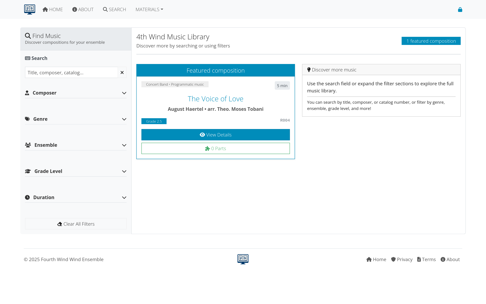

# Searching for music

This guide covers how to effectively search for compositions and other materials in AllanaCrusis using both basic and advanced search features.

## Table of contents
- [Search tips](#search-tips)
- [Search results](#search-results)
- [Advanced search features](#advanced-search-features)
- [Next steps](#next-steps)

---

## Search tips

1. **Use partial terms**: "Beethoven" will find "Beethoven, Ludwig van"
2. **Try different spellings**: The system is flexible with variations
3. **Use catalog numbers**: Direct lookup with C###, M###, or X### format
4. **Combine terms**: "Christmas March" will find relevant pieces

## Search results

Results display:
- Composition title and composer
- Catalog number and genre
- Ensemble and grade level
- Quick action buttons

*Figure 1: Global search bar and typical search results*

## Advanced search features

For more detailed searching:
- Multiple filter criteria
- Instrumentation requirements
- Grade level ranges
- Duration filters

*Figure 2: Advanced search with detailed filtering options*

---

## Next steps

With search capabilities understood:

1. **[Learn about compositions](compositions.html)** - Understand how musical works are organized
2. **[Explore supporting data](supporting-data.html)** - See how data enhances search
3. **[Getting started](getting-started.html)** - Return to the main getting started guide

---

*Continue to the next section: [Compositions](compositions.html) to learn about managing musical works.*