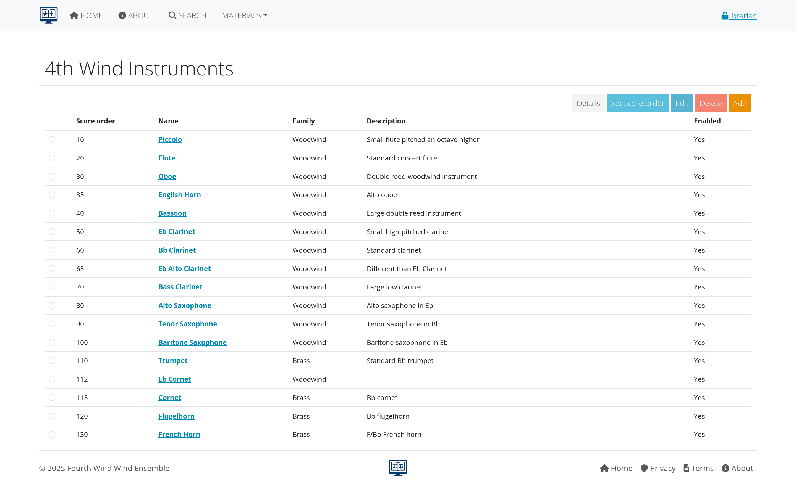
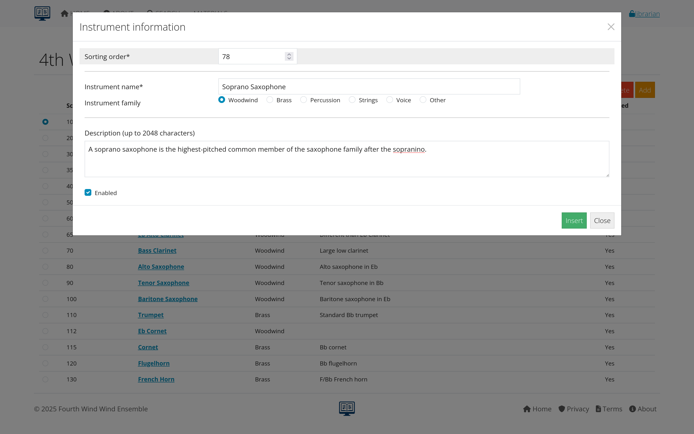
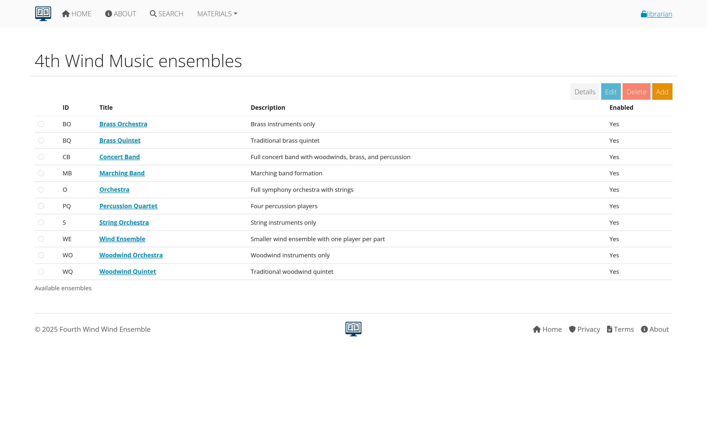
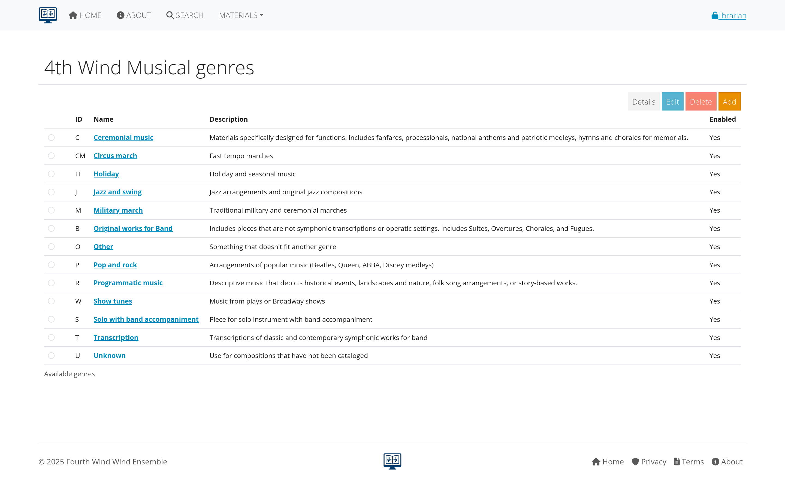
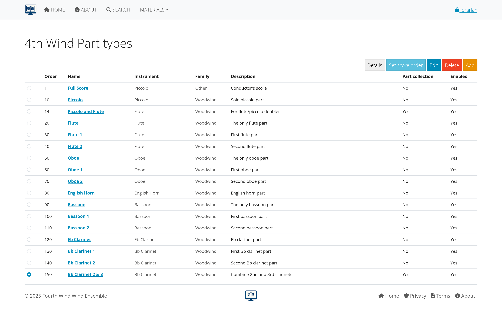

# Supporting Data Management

This section covers the foundational data that supports your music library: instruments, ensembles, genres, paper sizes, and part types. Understanding and properly managing this data is essential for effective library organization.

## Table of Contents
- [Overview of Supporting Data](#overview-of-supporting-data)
- [Instruments](#instruments)
- [Ensembles](#ensembles)
- [Genres](#genres)
- [Paper Sizes](#paper-sizes)
- [Part Types](#part-types)
- [Best Practices](#best-practices)

---

## Overview of Supporting Data

### What is Supporting Data?
Supporting data consists of the reference lists and categories that organize your music library:

- **Instruments**: Define what instruments are available for parts
- **Ensembles**: Specify which groups use the library
- **Genres**: Categorize musical styles and types
- **Paper Sizes**: Track physical dimensions of printed music
- **Part Types**: Classify different kinds of musical parts

### Why Supporting Data Matters
- **Consistency**: Ensures uniform data entry across the library
- **Organization**: Helps users find and filter content effectively
- **Reporting**: Enables meaningful statistics and analysis
- **Workflow**: Streamlines the process of adding new compositions

*Figure 1: How supporting data elements work together in AllanaCrusis*

---

## Instruments

### Purpose of Instrument Management
The instrument list defines all possible instruments that can be assigned to musical parts. This creates consistency in naming and enables effective searching and filtering.

### Viewing Instruments
1. Navigate to **MATERIALS > Instruments**
2. Browse the complete list of available instruments
3. Use the search/filter to find specific instruments
4. View instrument categories and groupings

*Figure 2: Instrument management interface*

### Adding New Instruments
**For Librarians and Managers:**

1. **Click "Add Instrument"**
2. **Fill in instrument details**:
   - **Name**: Full instrument name (e.g., "Clarinet in B♭")
   - **Short name**: Abbreviated version (e.g., "Cl")
   - **Category**: Instrument family (woodwinds, brass, etc.)
   - **Sort order**: Position in lists
   - **Active status**: Whether to show in selections

3. **Save the new instrument**

*Figure 3: Form for adding new instruments*

### Instrument Categories
Common categories include:
- **Woodwinds**: Flutes, clarinets, saxophones, oboes, bassoons
- **Brass**: Trumpets, horns, trombones, tubas
- **Percussion**: Timpani, mallet instruments, auxiliary percussion
- **Strings**: Violin, viola, cello, bass (if applicable)
- **Other**: Piano, harp, electronics, vocals

### Managing Instrument Names
**Best Practices:**
- Use standard instrument names
- Include key/pitch designations (e.g., "Horn in F")
- Be consistent with abbreviations
- Consider international naming conventions
- Include numbered parts (e.g., "Trumpet 1", "Trumpet 2")

---

## Ensembles

### Purpose of Ensemble Management
Ensembles define which musical groups use your library. This helps organize compositions by intended performing group and manage access permissions.

### Common Ensemble Types
- **Wind Ensemble**: Standard concert band instrumentation
- **Symphony Orchestra**: Full orchestral forces
- **Chamber Groups**: Small ensembles (quintet, sextet, etc.)
- **Jazz Ensemble**: Big band and jazz combo arrangements
- **Marching Band**: Field show and parade music
- **Choir**: Vocal ensembles

### Adding Ensembles
1. **Navigate to MATERIALS > Ensembles**
2. **Click "Add Ensemble"**
3. **Enter ensemble information**:
   - **Name**: Full ensemble name
   - **Short name**: Abbreviation
   - **Description**: Details about the group
   - **Active status**: Whether currently in use

*Figure 4: Ensemble setup and configuration*

### Ensemble Assignment
- Compositions are typically assigned to one primary ensemble
- Some pieces may be suitable for multiple ensembles
- Assignment affects search filtering and organization
- Users may have access restricted by ensemble membership

---

## Genres

### Purpose of Genre Classification
Genres help categorize musical styles and make it easier for users to find appropriate repertoire for their needs.

### Standard Genre Categories
Common genres include:

#### Concert Music
- **Wind Ensemble**: Standard concert band repertoire
- **Symphonic Transcription**: Orchestra pieces arranged for band
- **Contemporary**: Modern classical compositions
- **Light Classical**: Accessible classical works

#### Popular and Seasonal
- **March**: Military and concert marches
- **Christmas**: Holiday and seasonal music
- **Pop/Show Tunes**: Popular and Broadway arrangements
- **Film Music**: Movie soundtrack arrangements

#### Educational and Functional
- **Method Book**: Educational materials
- **Warm-up**: Exercises and technical studies
- **Ceremonial**: Processionals, hymns, patriotic music

### Managing Genres
1. **Go to MATERIALS > Genres**
2. **Review existing categories**
3. **Add new genres** as needed for your collection
4. **Organize by frequency of use**

*Figure 5: Genre categories and their organization*

---

## Paper Sizes

### Purpose of Paper Size Tracking
Paper sizes help librarians manage physical storage, copying, and distribution of printed music.

### Common Paper Sizes
- **Folio (9" x 12")**: Most common for band and orchestral music
- **Letter (8.5" x 11")**: Standard copy paper size
- **Legal (8.5" x 14")**: Extended length for complex scores
- **Tabloid (11" x 17")**: Large format for full scores
- **A4 (210mm x 297mm)**: International standard
- **Custom sizes**: For special or historical materials

### Paper Size Management
1. **Navigate to MATERIALS > Paper Sizes**
2. **View existing size definitions**
3. **Add custom sizes** if needed
4. **Set default sizes** for different types of music

*Figure 6: Paper size definitions and settings*

### Impact on Library Management
- **Storage planning**: Calculate shelf space requirements
- **Copying costs**: Different sizes have different costs
- **Distribution**: Affects packaging and mailing
- **Digital scanning**: Determines scan settings and file sizes

---

## Part Types

### Purpose of Part Type Classification
Part types categorize the different kinds of musical parts and materials in your library.

### Common Part Types
- **Individual Parts**: Single instrument parts
- **Condensed Score**: Reduced score for conductor reference
- **Full Score**: Complete conductor's score
- **Piano Reduction**: Piano accompaniment version
- **Vocal Parts**: Choral or solo vocal lines
- **Method Materials**: Educational and exercise materials

### Managing Part Types
1. **Go to MATERIALS > Part Types**
2. **Review current categories**
3. **Add specialized types** for your collection
4. **Set ordering preferences** for display

*Figure 7: Part type categories and configuration*

### Part Type Applications
- **Inventory tracking**: Know what materials you have
- **Distribution planning**: Different types have different distribution needs
- **Access control**: Some types may be restricted to certain users
- **Workflow organization**: Different processes for different part types

---

## Best Practices

### Data Consistency
- **Standardize naming conventions** across all supporting data
- **Use complete, descriptive names** rather than abbreviations when possible
- **Be consistent with capitalization** and punctuation
- **Consider future needs** when creating categories

### Regular Maintenance
- **Review supporting data periodically** for accuracy and completeness
- **Remove unused categories** to keep lists manageable
- **Update names and descriptions** as standards evolve
- **Document decisions** about naming and categorization

### User Training
- **Train all librarians** on proper use of supporting data
- **Create quick reference guides** for common categories
- **Establish approval processes** for adding new categories
- **Share decisions** with all users who enter data

### Integration Considerations
- **Plan for data imports** from other systems
- **Consider export needs** for reports and analysis
- **Think about integration** with other music software
- **Plan for system migrations** and data preservation

*Figure 8: Workflow for maintaining supporting data quality*

---

## Impact on Library Operations

### Search and Discovery
Well-organized supporting data enables:
- **Precise filtering** by instrument, genre, or ensemble
- **Consistent search results** across different users
- **Predictable navigation** through the library
- **Effective recommendation systems**

### Reporting and Analysis
Good supporting data supports:
- **Usage statistics** by category
- **Collection analysis** and gap identification
- **Planning reports** for acquisitions
- **Performance tracking** by ensemble or genre

### Workflow Efficiency
Proper setup enables:
- **Faster data entry** with predictable choices
- **Reduced errors** through standardized options
- **Streamlined processes** for adding new materials
- **Consistent user experience** across the system

---

## Getting Help

### Common Questions
- **Missing instruments**: Contact your librarian to add new instruments
- **Genre classifications**: Discuss with other librarians for consistency
- **Paper size questions**: Check with administrators about standards
- **Part type confusion**: Review examples and ask for clarification

### Who to Ask
- **System setup**: Managers and administrators
- **Music-specific questions**: Experienced librarians
- **Technical issues**: System administrators
- **Policy questions**: Organizational leadership

---

## Next Steps

With supporting data properly configured:

1. **[Learn Composition Management](compositions.html)** - Add and edit musical works
2. **[Explore Parts Management](parts.html)** - Handle individual parts and files
3. **[Review Search Features](getting-started.html#basic-search)** - Use your organized data for better searching

---

*Continue to the next section: [Compositions](compositions.html) to learn about managing musical works and their metadata.*