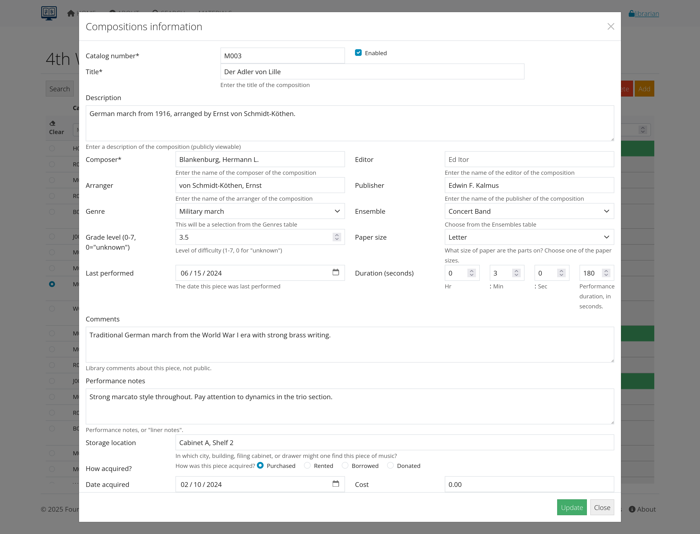
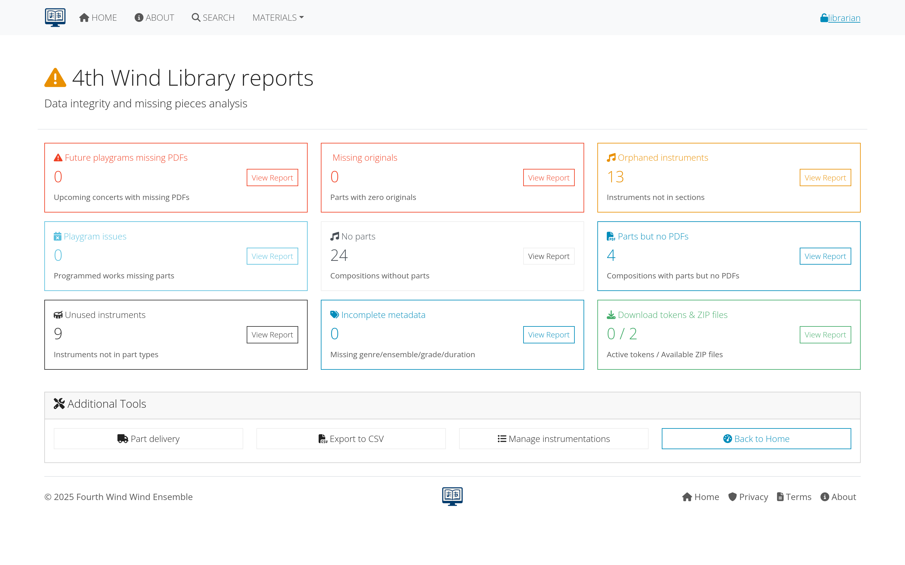

# Troubleshooting Guide

This comprehensive troubleshooting guide covers common issues users and administrators encounter with AllanaCrusis, along with step-by-step solutions and preventive measures.

## Table of Contents
- [Getting Help](#getting-help)
- [Login and Access Issues](#login-and-access-issues)
- [Search and Navigation Problems](#search-and-navigation-problems)
- [File and Download Issues](#file-and-download-issues)
- [Data Entry and Editing Problems](#data-entry-and-editing-problems)
- [Performance and Display Issues](#performance-and-display-issues)
- [Administrator Issues](#administrator-issues)
- [Browser and Compatibility Problems](#browser-and-compatibility-problems)

---

## Getting Help

### Before You Start Troubleshooting
1. **Note the specific error message** (if any)
2. **Remember what you were trying to do** when the problem occurred
3. **Check if the problem happens consistently** or just occasionally
4. **Try the same action in a different browser** or on a different device
5. **Check if other users are experiencing** the same issue

### Support Resources
**Self-Help:**
- **This troubleshooting guide**: Start here for common problems
- **User guide sections**: Detailed instructions for specific features
- **FAQ section**: Quick answers to frequent questions
- **Video tutorials**: Visual guides for complex procedures

**Direct Support:**
- **System administrator**: For technical and access issues
- **Librarian**: For content and process questions
- **Help desk**: If your organization has dedicated support
- **User community**: Other users who may have experienced similar issues

*Figure 1: Available support resources and how to access them*

---

## Login and Access Issues

### Cannot Log In
**Symptoms:** Login form doesn't work, error messages, or redirected to login page repeatedly.

#### Check Your Credentials
1. **Verify username**: Check spelling and capitalization
2. **Verify password**: Ensure Caps Lock is off, check for special characters
3. **Try "forgot password"**: Reset your password if unsure
4. **Check email verification**: Account may need email confirmation

#### Browser Issues
1. **Clear browser cache**: Old data may be interfering
2. **Delete cookies**: Remove stored login information
3. **Try incognito/private mode**: Bypass browser extensions and stored data
4. **Try different browser**: Chrome, Firefox, Safari, or Edge

#### Account Status Issues
1. **Contact administrator**: Account may be disabled or suspended
2. **Check email**: Look for account suspension or expiration notices
3. **Verify organization membership**: Access may be restricted to current members
4. **Wait and retry**: Temporary lockout may expire automatically

*Figure 2: Step-by-step login troubleshooting process*

### Email Verification Problems
**Symptoms:** Can't find verification email, verification link doesn't work.

#### Email Delivery Issues
1. **Check spam/junk folders**: Verification emails often filtered
2. **Check all email accounts**: Ensure using correct email address
3. **Wait a few minutes**: Email delivery can be delayed
4. **Request new verification email**: If original seems lost

#### Verification Link Problems
1. **Copy and paste full URL**: Don't just click the link
2. **Try different browser**: Link may have browser-specific issues
3. **Check for line breaks**: Email may have broken the URL
4. **Contact administrator**: Link may have expired

### Permission Denied Errors
**Symptoms:** "Access denied," "insufficient permissions," or missing menu items.

#### Role and Permission Issues
1. **Check your user role**: Confirm you have necessary permissions
2. **Contact administrator**: Request role upgrade if needed
3. **Verify ensemble membership**: Some content restricted by group
4. **Check account status**: Inactive accounts have limited access

#### Session Problems
1. **Log out and log back in**: Refresh your session
2. **Clear browser cookies**: Remove old session data
3. **Check session timeout**: Long idle periods may require re-login
4. **Try different browser**: Session conflicts may occur

---

## Search and Navigation Problems

### Search Not Working
**Symptoms:** No results when you expect them, search seems slow, or error messages.

#### Search Technique Issues
1. **Try broader terms**: Use fewer, more general search words
2. **Check spelling**: Typos prevent finding correct results
3. **Use partial terms**: "Beeth" instead of "Beethoven" 
4. **Try different fields**: Search composer, title, or catalog number separately

#### Filter Problems
1. **Clear all filters**: Remove genre, ensemble, or other restrictions
2. **Check date ranges**: Ensure not limiting to impossible dates
3. **Reset search form**: Start over with blank search
4. **Try advanced search**: More specific options may help

*Figure 3: Common search problems and solutions*

### Page Loading Issues
**Symptoms:** Pages load slowly, don't load completely, or show error messages.

#### Browser Performance
1. **Close other browser tabs**: Free up memory and processing power
2. **Restart browser**: Clear temporary files and reset performance
3. **Check internet connection**: Slow connections affect page loading
4. **Disable browser extensions**: Some extensions interfere with websites

#### Cache and Data Issues
1. **Clear browser cache**: Remove old page data
2. **Clear browser cookies**: Reset stored login and preference data
3. **Try incognito/private mode**: Bypass stored data and extensions
4. **Update browser**: Ensure using current version

### Navigation Menu Problems
**Symptoms:** Menu items missing, menus don't work, or wrong options showing.

#### Permission-Based Menu Issues
1. **Check user role**: Higher roles see more menu options
2. **Log out and back in**: Refresh menu permissions
3. **Contact administrator**: Role may need updating
4. **Verify account status**: Inactive accounts have limited menus

#### Browser Display Issues
1. **Try different browser**: Some browsers display menus differently
2. **Check screen resolution**: Very small screens may hide menu items
3. **Disable ad blockers**: May interfere with menu display
4. **Allow JavaScript**: Menus require JavaScript to function

---

## File and Download Issues

### Files Won't Download
**Symptoms:** Download doesn't start, files are corrupted, or permission errors.

#### Permission Issues
1. **Check file permissions**: You may not have download rights
2. **Verify account status**: Active membership may be required
3. **Contact administrator**: Request access to specific files
4. **Try different file**: Test if problem is file-specific or system-wide

#### Browser Download Issues
1. **Check download folder**: File may have downloaded to unexpected location
2. **Allow pop-ups**: Download may be blocked by pop-up blocker
3. **Try right-click save**: Alternative download method
4. **Clear download history**: Reset browser download settings

*Figure 4: Diagnosing and fixing download problems*

### File Quality Problems
**Symptoms:** Files are blurry, pages missing, or text unreadable.

#### File-Specific Issues
1. **Try different file**: Check if problem affects all files or just one
2. **Report file quality**: Contact librarian about specific files
3. **Request better version**: Higher quality scan may be available
4. **Check original source**: Problem may be with original document

#### Display and Software Issues
1. **Update PDF reader**: Ensure using current version of Adobe Reader or similar
2. **Try different PDF viewer**: Some viewers display files differently
3. **Check zoom level**: Zoom in for better text clarity
4. **Adjust display settings**: Screen resolution and color settings affect readability

### Upload Problems
**Symptoms:** Can't upload files, upload fails partway through, or files rejected.

#### File Format and Size Issues
1. **Check file format**: Ensure using supported file types (PDF, JPG, etc.)
2. **Check file size**: Large files may exceed system limits
3. **Compress files**: Reduce file size if too large
4. **Split large files**: Break into smaller parts if necessary

#### Permission and Access Issues
1. **Verify upload permissions**: May need librarian or manager role
2. **Check specific item permissions**: Some compositions may be locked
3. **Try different browser**: Upload compatibility varies
4. **Contact administrator**: May need special permissions for uploads

---

## Data Entry and Editing Problems

### Forms Not Saving
**Symptoms:** Changes don't save, form resets, or error messages when saving.

#### Form Validation Issues
1. **Check required fields**: Ensure all mandatory fields completed
2. **Verify data format**: Check date formats, numbers, etc.
3. **Review field length**: Some fields have character limits
4. **Check for special characters**: Some symbols may not be allowed

#### Session and Permission Issues
1. **Check session timeout**: Long editing sessions may expire
2. **Verify edit permissions**: Account may not allow editing this item
3. **Log out and back in**: Refresh session and permissions
4. **Try immediately after login**: Avoid session expiration issues

*Figure 5: Common form and data entry problems*

### Autocomplete Not Working
**Symptoms:** Composer names or other autocomplete fields don't suggest options.

#### Browser and JavaScript Issues
1. **Enable JavaScript**: Autocomplete requires JavaScript
2. **Clear browser cache**: Old data may interfere
3. **Try different browser**: Compatibility issues with some browsers
4. **Disable browser extensions**: Some extensions block autocomplete

#### Data and Configuration Issues
1. **Type more characters**: Some autocomplete requires 3+ characters
2. **Check spelling**: Typos prevent finding matches
3. **Try alternate spellings**: Different name formats may work
4. **Contact administrator**: Autocomplete data may need updating

### Duplicate Detection Issues
**Symptoms:** System allows duplicate entries or flags valid entries as duplicates.

#### Data Entry Technique
1. **Search before adding**: Check if item already exists
2. **Use consistent naming**: Follow established format conventions
3. **Check alternate spellings**: Item may exist with different spelling
4. **Verify catalog numbers**: Ensure using unique identifiers

#### System Configuration
1. **Report false positives**: Contact administrator about incorrect duplicate warnings
2. **Suggest improvements**: Recommend better duplicate detection rules
3. **Manual verification**: Double-check before overriding duplicate warnings
4. **Document exceptions**: Note why duplicates are legitimate if they are

---

## Performance and Display Issues

### Slow System Performance
**Symptoms:** Pages load slowly, searches take long time, or system feels sluggish.

#### User-Side Optimization
1. **Close other applications**: Free up computer memory and processing
2. **Check internet connection**: Slow connections affect performance
3. **Clear browser cache**: Remove accumulated temporary files
4. **Restart browser**: Reset browser performance

#### System Load Issues
1. **Try different times**: System may be busier during peak hours
2. **Contact administrator**: Report persistent performance problems
3. **Check system status**: Look for maintenance or known issues
4. **Use alternative access**: Try mobile app or different interface if available

*Figure 6: Tips for optimizing system performance*

### Mobile Device Issues
**Symptoms:** Site doesn't work well on phone or tablet, display problems.

#### Mobile Browser Issues
1. **Use supported browser**: Chrome, Safari, Firefox mobile
2. **Update browser**: Ensure using current mobile browser version
3. **Clear mobile browser cache**: Remove old data
4. **Try landscape orientation**: Some features work better in landscape

#### Mobile-Specific Features
1. **Use mobile-optimized pages**: Look for mobile version if available
2. **Adjust zoom level**: Find comfortable text size
3. **Use WiFi connection**: Mobile data may be slower
4. **Close other mobile apps**: Free up device memory

### Display and Layout Problems
**Symptoms:** Text overlaps, buttons missing, or layout looks wrong.

#### Browser Compatibility
1. **Update browser**: Use current version for best compatibility
2. **Try different browser**: Test with Chrome, Firefox, Safari, Edge
3. **Check browser settings**: Ensure standard settings enabled
4. **Disable extensions**: Some browser extensions interfere with layout

#### Screen and Display Settings
1. **Check zoom level**: Browser zoom may distort layout
2. **Adjust screen resolution**: Very high or low resolutions may cause issues
3. **Try full-screen mode**: Maximize browser window
4. **Check text size settings**: Operating system text size affects display

---

## Administrator Issues

### User Management Problems
**Symptoms:** Can't create users, email notifications not working, or permission issues.

#### Email Configuration Issues
1. **Test email settings**: Send test emails to verify configuration
2. **Check SMTP settings**: Server, port, authentication details
3. **Verify email templates**: Ensure notification templates are correct
4. **Check spam filtering**: Organization spam filter may block system emails

#### Permission and Role Issues
1. **Verify administrator permissions**: Ensure you have manager role
2. **Check user role hierarchy**: Understand permission levels
3. **Test with different users**: Isolate whether problem is user-specific
4. **Review audit logs**: Check what actions are being logged

*Figure 7: Troubleshooting workflow for administrator issues*

### Data Import/Export Problems
**Symptoms:** Import fails, exported data incomplete, or format errors.

#### File Format Issues
1. **Check file format**: Ensure using supported formats (CSV, Excel, etc.)
2. **Verify column headers**: Match expected field names exactly
3. **Check data encoding**: Ensure UTF-8 or compatible character encoding
4. **Validate data**: Check for missing required fields or invalid values

#### System Resource Issues
1. **Check file size limits**: Large files may exceed system capacity
2. **Break into smaller batches**: Import data in smaller chunks
3. **Schedule during off-hours**: Reduce system load during import
4. **Monitor system resources**: Check memory and disk space

### Backup and Recovery Issues
**Symptoms:** Backups failing, restore procedures not working, or data inconsistencies.

#### Backup Configuration
1. **Verify backup schedule**: Ensure automated backups are configured correctly
2. **Check storage space**: Backup destination may be full
3. **Test backup integrity**: Regularly verify backups are complete and usable
4. **Document procedures**: Maintain current backup and restore instructions

#### Recovery Procedures
1. **Practice recovery**: Regularly test restore procedures
2. **Verify data integrity**: Check restored data for completeness and accuracy
3. **Update procedures**: Keep recovery instructions current
4. **Train staff**: Ensure multiple people can perform recovery if needed

---

## Browser and Compatibility Problems

### Browser-Specific Issues
Different browsers may have different compatibility levels with AllanaCrusis.

#### Recommended Browsers
1. **Chrome**: Generally best compatibility and performance
2. **Firefox**: Good alternative with strong security features
3. **Safari**: Works well on Mac and iOS devices
4. **Edge**: Microsoft's modern browser with good compatibility

#### Browser Settings
1. **Enable JavaScript**: Required for most AllanaCrusis features
2. **Allow cookies**: Necessary for login and preferences
3. **Enable pop-ups**: May be needed for downloads and new windows
4. **Update regularly**: Keep browser current for security and compatibility

*Figure 8: Browser compatibility and recommended settings*

### Operating System Issues
**Symptoms:** Features don't work on specific operating systems.

#### Windows Issues
1. **Update Windows**: Ensure using supported Windows version
2. **Check Internet Explorer**: Avoid using Internet Explorer
3. **Use Edge or Chrome**: Better compatibility with modern web standards
4. **Check security settings**: Windows security may block some features

#### Mac Issues
1. **Use Safari or Chrome**: Best compatibility on Mac systems
2. **Update macOS**: Ensure using supported operating system version
3. **Check Safari settings**: Ensure standard web features enabled
4. **Try Chrome**: Alternative if Safari has issues

#### Mobile Operating Systems
1. **iOS**: Use Safari or Chrome mobile browser
2. **Android**: Use Chrome or Firefox mobile browser
3. **Update mobile OS**: Ensure using supported version
4. **Clear mobile browser data**: Remove cache and cookies regularly

### Accessibility Issues
**Symptoms:** System doesn't work with screen readers or other assistive technology.

#### Screen Reader Compatibility
1. **Use supported screen readers**: JAWS, NVDA, VoiceOver
2. **Enable browser accessibility**: Turn on accessibility features
3. **Navigate with keyboard**: Ensure all features accessible without mouse
4. **Report accessibility problems**: Contact administrator about barriers

#### Visual Accessibility
1. **Adjust browser zoom**: Increase text size as needed
2. **Use high contrast**: Browser or operating system high contrast modes
3. **Check color settings**: Ensure sufficient contrast for readability
4. **Use browser accessibility tools**: Built-in tools for visual impairments

---

## Preventive Measures

### Regular Maintenance
**For Users:**
- **Clear browser cache monthly**: Prevent accumulation of old data
- **Keep browsers updated**: Ensure security and compatibility
- **Use bookmarks**: Save frequently used pages for quick access
- **Learn keyboard shortcuts**: Improve efficiency and reduce errors

**For Administrators:**
- **Monitor system performance**: Watch for slowdowns or errors
- **Review user feedback**: Address common problems proactively
- **Update documentation**: Keep troubleshooting guides current
- **Train users**: Prevent problems through education

### Best Practices
**Data Entry:**
- **Follow naming conventions**: Consistent formats prevent errors
- **Double-check before saving**: Verify information accuracy
- **Use copy and paste carefully**: Avoid formatting issues
- **Save work frequently**: Prevent loss due to session timeouts

**System Usage:**
- **Log out when finished**: Protect account security
- **Report problems promptly**: Help improve system for everyone
- **Keep contact information current**: Ensure you receive important notifications
- **Participate in training**: Stay current with new features and best practices

*Figure 9: Checklist for preventing common problems*

---

## Emergency Procedures

### System Outages
**If AllanaCrusis is completely unavailable:**
1. **Check system status page**: Look for known outage information
2. **Try different devices**: Verify problem isn't device-specific
3. **Contact administrator**: Report outage if not already known
4. **Use alternative access**: Mobile app or backup systems if available

### Data Loss or Corruption
**If data appears to be lost or corrupted:**
1. **Don't panic**: Most data loss can be recovered
2. **Document the problem**: Note what data is missing or incorrect
3. **Contact administrator immediately**: Quick action improves recovery chances
4. **Avoid making changes**: Don't try to fix problems yourself

### Security Incidents
**If you suspect unauthorized access:**
1. **Change password immediately**: Secure your account
2. **Log out from all devices**: End all active sessions
3. **Contact administrator**: Report security concerns immediately
4. **Monitor account activity**: Watch for unusual activity

---

## Getting Additional Help

### Escalation Procedures
**When basic troubleshooting doesn't work:**
1. **Document the problem**: Include error messages, steps taken, and results
2. **Contact your local administrator**: First line of support
3. **Provide detailed information**: Help support staff understand the issue
4. **Be patient**: Complex problems may take time to resolve

### Support Resources
**Internal Support:**
- **System administrator**: First contact for most issues
- **Librarian**: Content and process questions
- **IT department**: Network and infrastructure issues
- **Training coordinator**: Help with learning new features

**External Support:**
- **AllanaCrusis documentation**: Official user guides and resources
- **Technical support**: Vendor or developer assistance
- **User community**: Forums and discussion groups
- **Professional services**: Consulting and implementation help

---

*This completes the comprehensive AllanaCrusis documentation. Each section builds upon the previous ones to provide complete guidance for users at all levels.*