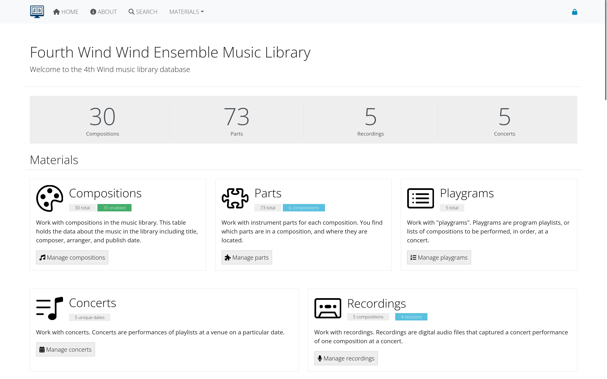

# AllanaCrusis Music Library User Guide

## Table of Contents
1. [Getting Started](#getting-started)
2. [User Roles and Permissions](#user-roles-and-permissions)
3. [Navigation and Interface](#navigation-and-interface)
4. [Composition Management](#composition-management)
5. [Parts Management](#parts-management)
6. [Search and Filtering](#search-and-filtering)
7. [User Management](#user-management)
8. [Reports and Analytics](#reports-and-analytics)
9. [Librarian Instructions](#librarian-instructions)
10. [Troubleshooting](#troubleshooting)

---

## Getting Started

### System Requirements
- Web browser (Chrome, Firefox, Safari, Edge)
- Internet connection
- Login credentials provided by your library administrator

### First Login
1. Navigate to your library's URL (typically https://yourdomain.com)
2. Click "Login" in the top navigation
3. Enter your username and password
4. If this is your first login, you may be prompted to verify your email address

### Interface Overview
The AllanaCrusis interface uses a clean, responsive design with:
- **Top Navigation**: Quick access to main sections (Materials, Reports, Users, etc.)
- **Search Bar**: Global search functionality with real-time filtering
- **Action Buttons**: Color-coded buttons for different functions (blue for edit, green for add, red for delete)
- **Tables**: Sortable, filterable data displays with sticky headers

*Figure 1: Main AllanaCrusis interface with highlighted navigation elements*

---

## User Roles and Permissions

### Guest User
- View public compositions and recordings
- Use search functionality
- No editing capabilities

### Member
- Full guest permissions
- Access to part downloads (if enabled)
- View contact information

### Librarian
- Full member permissions
- Add, edit, and delete compositions
- Manage instrumentation and parts
- Access to all management functions except user administration

### Manager
- Full librarian permissions
- User management (add, edit, delete users)
- System configuration access
- Full administrative control

---

## Navigation and Interface

### Main Menu Sections

#### MATERIALS
- **Compositions**: Manage musical compositions, metadata, and basic information
- **Parts**: Individual part management, file uploads, and distribution
- **Instruments**: Instrument definitions and categories
- **Genres**: Musical genre classifications
- **Ensembles**: Ensemble definitions and assignments

#### REPORTS
- **Search**: Advanced search with multiple filters
- **Reports**: Usage statistics and analytics

#### ADMIN (Manager only)
- **Users**: User account management
- **System Settings**: Configuration options

### Search and Filter Features
- **Real-time filtering**: Tables update as you type
- **Composer autocomplete**: Automatic suggestions with "Last, First" formatting
- **Advanced search**: Multiple criteria including composer, title, genre, instrumentation
- **Sticky headers**: Column headers remain visible while scrolling

---

## Composition Management

### Adding a New Composition
1. Navigate to **MATERIALS > Compositions**
2. Click the **Add New Composition** button
3. Fill in required fields:
   - **Catalog Number**: Unique identifier (format: C###, M###, or X###)
   - **Title**: Full composition title
   - **Composer**: Use "Last, First" format

*Figure 2: New composition form showing required fields*

4. Optional fields:
   - **Arranger**: If applicable
   - **Publisher**: Publishing company
   - **Genre**: Select from predefined categories
   - **Grade Level**: Difficulty rating (1-7)
   - **Duration**: Performance time in minutes

### Editing Existing Compositions
1. Find the composition using search or browse
2. Click the blue **Edit** button
3. Update any necessary fields
4. Click **Update** to save changes

### Composer Name Formatting
The system includes composer normalization features:
- Use "Last, First" format (e.g., "Beethoven, Ludwig van")
- Autocomplete suggestions help maintain consistency
- The system automatically formats names for display

---

## Parts Management

### Adding Parts to a Composition
1. Navigate to the composition's **Instrumentation** page
2. Select instruments from the **Instrument Parts** list
3. Hold Ctrl/Cmd to select multiple instruments
4. Click **Add Parts**

### Managing Individual Parts
1. Go to **MATERIALS > Parts**
2. Find your composition and click the title
3. For each part, click the blue **Edit** button to:
   - Set page count and paper size
   - Update originals count (how many physical copies exist)
   - Add descriptions or notes
   - Assign specific instruments

### File Management
- Upload PDF files for digital distribution
- Set access permissions for downloads
- Track file versions and updates

---

## Search and Filtering

### Quick Search
- Use the search bar in the top navigation for global searches
- Searches across titles, composers, arrangers, and catalog numbers

### Advanced Search
1. Navigate to **REPORTS > Search**
2. Use multiple filter criteria:
   - **Title**: Partial or full title matching
   - **Composer**: With autocomplete assistance
   - **Genre**: Select from dropdown
   - **Instrumentation**: Filter by required instruments
   - **Grade Level**: Difficulty range
   - **Duration**: Time range

### Table Filtering
- Most data tables include real-time filter boxes
- Type to filter results instantly
- Combine with sorting by clicking column headers

---

## User Management
*(Manager access required)*

### Adding New Users
1. Navigate to **ADMIN > Users**
2. Click **Add New User**
3. Fill in user information:
   - Username and email
   - Password (temporary)
   - Role assignment
   - Ensemble assignment

### Managing Existing Users
- Edit user details and permissions
- Reset passwords
- Enable/disable accounts
- Assign to different ensembles

---

## Reports and Analytics

### Available Reports
- **Composition Statistics**: Counts by genre, composer, etc.
- **Usage Reports**: Download and access statistics
- **Missing Parts**: Identify incomplete instrumentation

### Generating Reports
1. Navigate to **REPORTS**
2. Select the desired report type
3. Set date ranges and filters as needed
4. Export results if available

---

## Librarian Instructions

#### Part 1: Music Information
1. Sign in to the library at https://allanacrusis.net Confirm that you have librarian access.
2. Select MATERIALS → Compositions to enter the Compositions page.
3. Enter all or part of the title, composer, or arranger of your piece in the search field, and choose Search to find your piece in the library list. Choose the blue EDIT button.

**On the edit screen:**

a. Confirm that the catalog number matches what appears on the folder. The number in the catalog should be a letter followed by three numbers (C###, M###, or X###) even if the folder has fewer numbers. If necessary, add zeroes to the front of the number to make it three digits.

b. Confirm that Enabled is selected, so that the piece appears in searches and selections.

c. Confirm the Title of the piece, including the spelling. Articles should follow the title, separated by a comma; e.g. Liberty Bell, The. This is true for both English articles (a, an, the) and non-English articles (la, le, les, los, die, der, etc.).

d. Confirm the Composer, Arranger, and Editor names are correct. Family names should be listed first, followed by given names. If names or parts of names are missing, please add them. NOTE: Composer is a required field. If no composer is listed on a piece, enter Traditional or (n/a), whichever seems more accurate. Arranger and Editor fields can be left blank if the piece does not have them.

e. Confirm or add the Publisher. You can generally drop words like Inc, Publisher, Company, and such. For example, Hal Leonard Corporation can be listed just as Hal Leonard.

f. Select the Genre from the drop-down menu. For most pieces, you will use one of the following:
   - Wind Ensemble—for most general band pieces
   - Symphonic Transcription—for pieces originally written for orchestra
   - March—for marches
   - Christmas—for holiday music
   - Pop/Show Tunes (as appropriate)—for band versions of popular or Broadway/movie songs
   - Solo with band accompaniment—for solos

If it's not clear what genre is appropriate, go with Wind Ensemble.

g. Confirm that the Ensemble box says Fourth Wind Wind Ensemble. You should not encounter any exceptions to this.

h. Consult the piece's score to see if it lists Grade level (sometimes called difficult, should be a number between 1 and 7) or Duration. If neither is listed in the score, check the Wind Repertory Project site (https://www.windrep.org) for the information. You can also use the Wind Repertory Project link button at the bottom of the Edit screen. In either case, please confirm that you are looking at the correct edition for the piece. Check the arranger's name and/or publisher if necessary. Enter the grade and duration in the correct fields. If neither is available, leave blank.

i. Select the Paper Size from the drop-down menu. Most band music is printed on Folio paper (9x12), but some are on Letter (8.5x11) or Marching band paper.

j. Choose Update to save your changes.

#### Part 2: Instrumentation
1. On the search screen, find your piece again. This time, choose Instrumentation to access the Enter Instrumentation screen.
2. Confirm that the Catalog number, title, and paper size are correct.
3. In the Page count field, enter the average number of pages for each part in the piece. For example, if each part is only one page like most marches, enter 1. This does not have to be exact. Just take a look at a few parts and estimate the average. You can update the number of pages in individual parts later.
4. In the Instrument Parts box, select ALL of the parts that appear in the piece. There are a couple of ways to get this information:
   - Check the front of the score. Many pieces have the instrumentation listed there.
   - Go through the parts in the folder and enter all of the parts. Most pieces should have a set of file copies pulled together; if that is the case you can just use the file copies to get the instrumentation. If there isn't a file copies set, you may have to look through the parts individually. (But feel free to pull together a file copies set while you're doing that. Jarred is happy to give you tips on how to do that.)

To select multiple parts at once, hold down the Control key as you click.
Try to select parts from the list whose names match what's on the music. If you have a part that does not appear in the list, let Jarred or Warren know and they will add it. This can be especially tricky with percussion parts.
Once you have selected all parts, choose Add parts.

5. Choose MATERIALS > Parts from the menu at the top of the page.
6. Find your piece in the list (they are listed in catalog number order) and choose the title to see the list of parts. Check the list to be sure it is correct.
7. For each part in the list, choose the blue Edit button.
   
   a. Check that the Pages and Paper size fields reflect the number and size of pages for that part.
   
   b. For every part you actually have in the folder, enter 1 in the Originals Count field. If any part is supposed to be there but is missing, enter 0 in that field. [The 1 should be in place by default, but check the parts to be sure.]
   
   c. Enter any name or description if needed. For example if the original has many annotations (pen/pencil marks), is deckle-edged or torn, or has pages missing, enter that in the description.
   
   d. Add the instrument(s) on the part to the instruments list. Usually, the default (noted with an asterisk) is already added, and correct. For parts—most likely percussion—that include multiple instruments not reflected in the part name, [This is most common for parts labeled Percussion 1, Mallet Percussion, Auxiliary Percussion, or the like.] add all the instruments that appear on the part to the instruments list. If a part has two of the same instrument (for example Flute 1 & 2), add the same instrument to the list, so that it appears on the list twice. To select multiple instruments at once, hold down the Control key as you click.

Optionally, in the Description field, enter the instruments that appear on the part (snare drum, bass drum, crash cymbals, etc.). Sometimes these parts will be listed at the top of the part with the Percussion label. Sometimes you'll have to look through the part to find the instruments. If you have any questions, ask Jarred, Warren, or a percussionist.

8. Choose Update to save your changes.

---

## Troubleshooting

### Common Issues and Solutions

#### Login Problems
- **Forgot password**: Use the "Reset Password" link on the login page
- **Email not verified**: Check your email for verification message
- **Account locked**: Contact your system administrator

#### Search Not Working
- **No results found**: Try broader search terms or check spelling
- **Filters not responding**: Clear browser cache and refresh page
- **Autocomplete not working**: Ensure JavaScript is enabled

#### File Upload Issues
- **PDF won't upload**: Check file size (max 10MB) and format
- **Slow uploads**: Ensure stable internet connection
- **Access denied**: Verify you have librarian or manager permissions

#### Display Issues
- **Tables not loading**: Refresh page or clear browser cache
- **Mobile display problems**: Try rotating device or using desktop browser
- **Missing buttons**: Check your user permissions level

### Getting Help
- **Documentation**: This user guide and system help pages
- **Technical Support**: Contact your system administrator
- **Training**: Request additional training sessions if needed

### Browser Compatibility
AllanaCrusis works best with:
- Chrome (recommended)
- Firefox
- Safari
- Edge

For optimal performance:
- Enable JavaScript
- Allow cookies
- Use the latest browser version

---

## Recent Updates and New Features

### Enhanced Search and Filtering (October 2025)
- Real-time table filtering across all data views
- Improved search performance and accuracy
- Sticky table headers for better navigation

### Composer Normalization (October 2025)
- Automatic "Last, First" name formatting
- Autocomplete suggestions for consistent data entry
- Bulk composer name standardization tools

### User Interface Improvements (September 2025)
- Responsive design for mobile and tablet devices
- Improved color coding and visual hierarchy
- Enhanced accessibility features

### System Performance (August 2025)
- Faster page loading times
- Optimized database queries
- Improved file handling and uploads

---

## Additional Resources

### External Links
- [Wind Repertory Project](https://www.windrep.org) - Grade levels and performance information
- [IMSLP](https://imslp.org) - Public domain scores and information
- [Band Music PDF Library](https://www.bandmusicpdf.org) - Additional repertoire resources

### Best Practices
- **Data Entry**: Use consistent formatting for composer names and titles
- **File Naming**: Use clear, descriptive names for uploaded files
- **Regular Backups**: Administrators should maintain regular data backups
- **User Training**: Ensure new users complete orientation before access

### Contact Information
For technical support or questions about this user guide, contact your system administrator or library manager.

---

*This user guide covers the core functionality of AllanaCrusis Music Library System. For the most current features and updates, check the "What's New" section on the About page.*